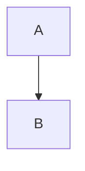

# Sphinxドキュメントガイドライン

## ルール

- [MyST](https://mystmd.org/guide) 記法で記述する
- 「革新的」「画期的」など、誇張した表現は使わない
- `**` などの強調した修飾は必要なときのみ記述する(乱用しない)
- 見出しに番号を付けない (NG: `## 1. 見出し`, OK: `## 見出し`)

## MyST Tips

```{admonition} 特記事項
MySTで特記したい内容は、通常の段落ではなくadmonitionを使用して視認性を高める。
```

詳細な手順は {ref}`literalincludeの利用 <myst-literalinclude>` と {ref}`見出しのラベルとクロスリファレンス <myst-heading-label>` を参照。

(myst-literalinclude)=
### literalincludeの利用

ソースコードや長めの設定ファイルは手動で貼り付けず、`literalinclude` ディレクティブで取り込む:

````markdown
```{literalinclude} ../../src/example.py
:language: python
:lines: 10-30
```
````

- `:language:` でシンタックスハイライトを指定する
- `:lines:` や `:start-after:` などのオプションで必要な範囲に絞る

(myst-heading-label)=
### 見出しのラベルとクロスリファレンス

MySTで見出しへリンクする場合は、見出し直前にラベルを追加し、`{ref}` で参照する:

````markdown
(feature-overview)=
## 機能概要

他のセクションからは {ref}`機能概要 <feature-overview>` と記述する。
````

## ビルド

```bash
uv run sphinx-build -M html docs docs/_build
```

## コードブロック構文ハイライト注意事項

Sphinxビルド時に構文ハイライトエラーが発生しやすいパターンと対策:

### 1. TOML内のnull値

❌ **NG**: TOMLコードブロック内で `key = null` と記述
```toml
session_id = null  # Pygments lexerがエラー
```

✅ **OK**: コメントアウトで説明
```toml
# session_id = null  # nullで新規作成、文字列で既存復元
```

### 2. JSON内の省略記号 (ellipsis)

❌ **NG**: JSON配列/オブジェクト内に `...` や `...,` を記述
```json
["item1", "item2", ...]  # lexerエラー
```

✅ **OK**: 省略記号を削除
```json
["item1", "item2"]
```

### 3. 不明なlexer名

❌ **NG**: Pygmentsが認識しないlexer名
```markdown
- `gitignore` → Pygmentsに存在しない
- `.env` → 無効な名前
```

✅ **OK**: 代替lexerを使用
```markdown
- `text` または `bash` を使用
- `.env`ファイルは `bash` で代用
```

### 4. 特殊文字を含むコードブロック

❌ **NG**: 矢印記号など、lexerが解釈できない文字
```python
→   if condition:  # 矢印記号がエラー
```

✅ **OK**: コメントやプレーンテキストで説明
```python
# <TAB>if condition:  # タブを明示的に記述
```

### 5. Mermaid図表の記述

このプロジェクトでは `sphinxcontrib.mermaid` を使用しています。

❌ **NG**: 一般的なMarkdownのmermaid記法
````markdown

````

✅ **OK**: MyST + sphinxcontrib.mermaidの記法
````markdown
```{mermaid}
graph TD
    A --> B
```
````

### ビルドエラー確認方法

ビルド後、以下の警告に注意:
```
WARNING: Lexing literal_block '...' as "言語名" resulted in an error at token: '文字'.
Retrying in relaxed mode. [misc.highlighting_failure]
```

この警告が出た場合は、該当コードブロックの言語指定またはコンテンツを修正してください。
