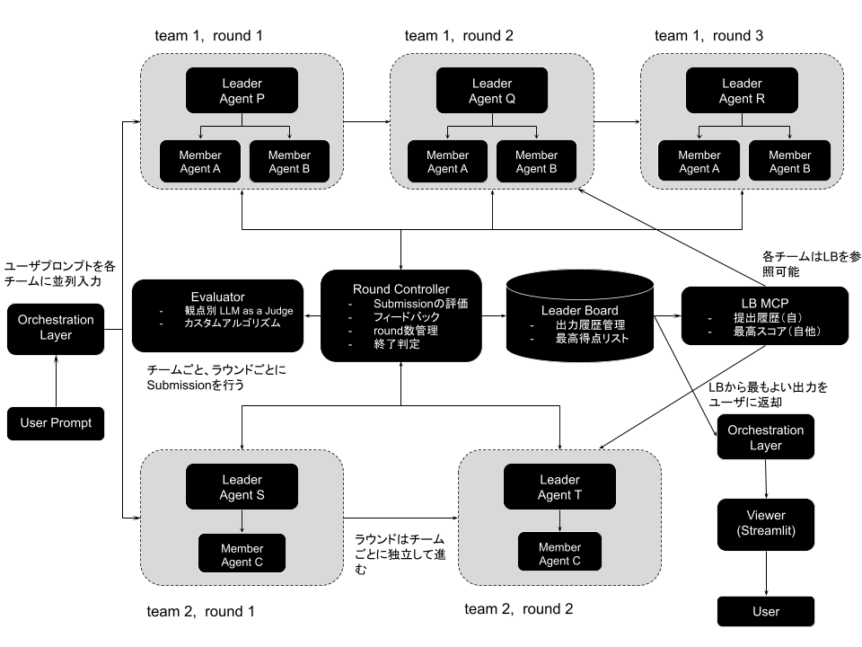

# MixSeek-Core コンセプト

## プロジェクトの思想

mixseek-core は、LLM を活用したマルチエージェントオーケストレーションフレームワークである。
**複数チームが同一タスクにコンペティション形式で取り組み、反復的に回答を改善する**という競合改善メカニズムを中核とする。

単一エージェントでは到達しにくい品質を、専門性の異なるエージェントの協調と、
ラウンドごとの評価フィードバックによる反復改善で実現する。

## アーキテクチャ概観



## コア概念

### Team

1 名の Leader Agent と複数の専門 Member Agent で構成される協調単位。
TOML ファイルでチーム構成を事前定義し、ユーザーが明示的に指定する（自動決定は行わない）。
Member Agent 数の上限は設定可能。

### Leader Agent

チーム内の指揮者。以下の責務を持つ:

- ユーザータスクの分析と複雑度評価
- 必要な専門性の特定と Member Agent の動的選択
- Member Agent への作業委任（Pydantic AI Tool Delegation パターン）
- 各 Member の出力を統合した Submission の生成

Leader Agent は LLM として動作し、tool call により Member Agent を呼び出す。
全 Member Agent は Leader と同一プロセス内で実行される（高速・低オーバーヘッド）。

### Member Agent

特定ドメインに特化した専門作業者。2 種類が存在する:

**システム標準 Member Agent** — フレームワークに組み込まれたエージェント:

- **plain**: 汎用推論（外部ツールなし）
- **web_search**: Web 検索による情報収集
- **web_fetch**: URL コンテンツの取得・解析
- **code_execution**: サンドボックス内でのコード実行

**ユーザー作成 Member Agent** — SDK で独自開発するカスタムエージェント:

- `BaseMemberAgent` 基底クラスを継承し `execute(task, context)` を実装
- TOML 設定 + Python 実装コードの両方が必要
- `agent_module`（パッケージ import）または `path`（ファイル直接指定）で動的ロード

### Round（ラウンド）

チームが Submission を生成し、評価フィードバックを受ける 1 サイクル。

**ラウンド間の状態引き継ぎ**:
各ラウンドはクリーンなコンテキストで開始する。
引き継がれるのは**前ラウンドの Submission 結果と評価フィードバックのみ**。
評価フィードバックを新しいプロンプトとして追加することで、反復的な品質改善を実現する。

**3 段階の継続判定**:

1. **最小ラウンド数** — 未達なら無条件で継続
2. **LLM 判定** — スコア推移と改善可能性を LLM が判断
3. **最大ラウンド数** — 到達時は強制終了し、最高スコアの Submission を返却

### Submission

チームが生成する回答出力。現状では文字列のみをサポート。

### Evaluator

Submission に対して定量スコアと定性フィードバックを提供する。
複数のメトリクスを組み合わせ、重み付き総合スコアを算出する。

**評価器の種類**:

- **LLM-as-a-Judge**: Pydantic AI Agent による柔軟な LLM 評価。
  組み込みメトリクス: ClarityCoherence, Coverage, Relevance, LLMPlain
- **カスタム評価関数**: Python コードによる任意の評価ロジック。
  `BaseMetric` を継承して `evaluate()` を実装

**重み設定**: 各メトリクスに重みを指定可能。未指定時は均等配分。

### Leader Board

全チーム・全ラウンドの Submission とスコアを管理するランキングシステム。
DuckDB で永続化され、ダッシュボード（Streamlit UI）で閲覧可能。

## 設定体系

TOML ファイルによる階層的な設定管理を採用する。

```
orchestrator.toml
├── [orchestrator]          # 全体設定（並列数、タイムアウト等）
├── [[orchestrator.teams]]
│   └── config = "agents/team_xxx.toml"   # チーム設定への参照
│
team_xxx.toml
├── [team]                  # チーム基本情報
├── [team.leader]           # Leader Agent 設定（model, instructions 等）
└── [[team.members]]        # Member Agent 設定（複数定義可）
    ├── 直接埋め込み        # agent_name, agent_type, model 等を記述
    └── config = "agents/xxx.toml"  # 外部ファイル参照も可能
```

**設定優先順位**: CLI 引数 > 環境変数 > TOML > デフォルト値

## エラーハンドリングの原則

- Member Agent またはEvaluator でエラー発生時、該当**チーム全体を即座に失格**とする
- 他チームの処理は継続し、残存チームの結果のみで評価を行う
- タイムアウトやエラー後でも完了済みラウンドがあれば、部分成功として最善結果を返却
- HTTP 接続エラーには指数バックオフリトライを適用

## 永続化

- **DuckDB**: ラウンド履歴、Leader Board、実行サマリーを集約保存
- **進捗ログ**: リアルタイム UI 用に `{workspace}/logs/` に出力

## 技術基盤

- **Pydantic AI**: Agent 実行、Tool Delegation、構造化出力、組み込みツール
- **Pydantic v2**: 全モデルの型安全性、バリデーション、JSON Schema
- **DuckDB**: MVCC 対応の組み込みデータベース
- **TOML**: 階層的設定管理
- **Streamlit**: 監視 UI
