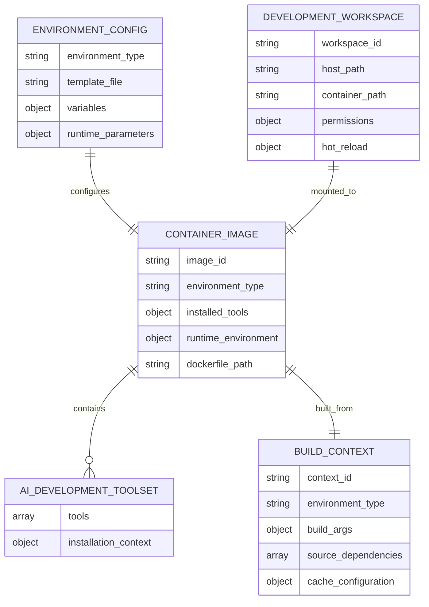
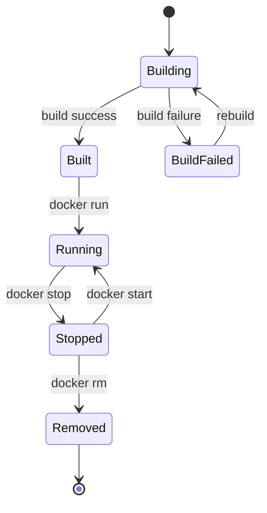
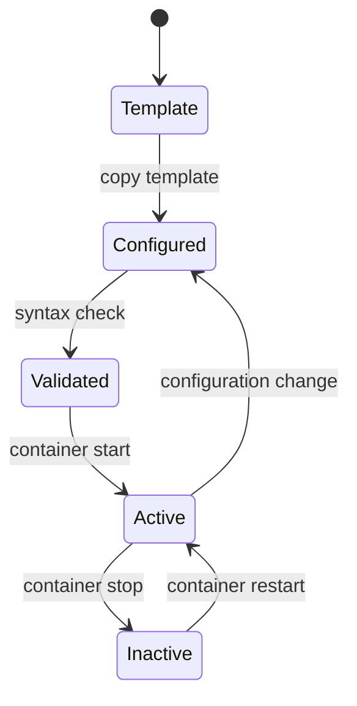

# データモデル: Docker開発環境テンプレート

**Feature**: Docker開発環境テンプレート
**Created**: 2025-10-15

## 概要

このドキュメントは、Docker開発環境テンプレートシステムの主要エンティティとそのデータモデルを定義します。

## 主要エンティティ

### 環境設定 (Environment Configuration)

環境固有の設定を表現するデータモデル。

```yaml
# Schema: Environment Configuration
environment_config:
  environment_type:
    type: string
    enum: ["dev", "ci", "prod"]
    description: "環境タイプの識別子"

  template_file:
    type: string
    pattern: "^dockerfiles/templates/\\.env\\.[a-z]+\\.template$"
    description: "環境変数テンプレートファイルのパス"

  variables:
    type: object
    description: "環境固有の変数定義"
    properties:
      required:
        type: array
        items:
          type: string
        description: "必須環境変数のリスト"
      optional:
        type: array
        items:
          type: string
        description: "オプション環境変数のリスト"
      secrets:
        type: array
        items:
          type: string
        description: "機密情報として扱う変数のリスト"

  runtime_parameters:
    type: object
    description: "環境固有のランタイムパラメータ"
    properties:
      resource_limits:
        type: object
        properties:
          enabled:
            type: boolean
            default: false
            description: "リソース制限の有効/無効"
      port_mappings:
        type: array
        items:
          type: object
          properties:
            host_port:
              type: integer
            container_port:
              type: integer
            protocol:
              type: string
              enum: ["tcp", "udp"]
```

**関係性**:
- コンテナイメージに1:1で対応
- ビルドコンテキストで参照される

**バリデーションルール**:
- `environment_type`は定義済みの値のみ許可
- `secrets`配列の変数は`variables.required`または`variables.optional`に含まれている必要がある
- テンプレートファイルは実際に存在する必要がある

---

### コンテナイメージ (Container Image)

構築されたDockerイメージとその設定を表現するデータモデル。

```yaml
# Schema: Container Image
container_image:
  image_id:
    type: string
    description: "イメージの一意識別子"

  environment_type:
    type: string
    enum: ["dev", "ci", "prod"]
    description: "対象環境タイプ"

  base_image:
    type: string
    description: "ベースイメージ名"
    default: "ghcr.io/astral-sh/uv:0.8.24-python3.13-bookworm-slim"

  installed_tools:
    type: object
    description: "インストール済みツールセット"
    properties:
      python_tools:
        type: array
        items:
          type: string
        description: "Pythonツール（uv, pytest, ruff等）"
      nodejs_tools:
        type: array
        items:
          type: string
        description: "Node.jsツール（開発環境のみ）"
      ai_development_tools:
        type: array
        items:
          type: string
        description: "AI開発ツール（Claude Code, Codex, Gemini CLI）"
      system_packages:
        type: array
        items:
          type: string
        description: "システムパッケージ"

  runtime_environment:
    type: object
    description: "ランタイム環境設定"
    properties:
      python_version:
        type: string
        pattern: "^3\\.[0-9]+\\.[0-9]+$"
        description: "Pythonバージョン"
      nodejs_version:
        type: string
        pattern: "^[0-9]+\\.[0-9]+\\.[0-9]+$"
        description: "Node.jsバージョン（開発環境のみ）"
      working_directory:
        type: string
        default: "/app"
        description: "作業ディレクトリ"
      user:
        type: object
        properties:
          username:
            type: string
            description: "実行ユーザー名"
          uid:
            type: integer
            description: "ユーザーID"
          gid:
            type: integer
            description: "グループID"

  dockerfile_path:
    type: string
    pattern: "^dockerfiles/[a-z]+/Dockerfile$"
    description: "Dockerfileのパス"

  makefile_path:
    type: string
    pattern: "^dockerfiles/[a-z]+/Makefile$"
    description: "環境固有Makefileのパス"
```

**ライフサイクル**:
1. `build`: Dockerfileからイメージ構築
2. `running`: コンテナとして実行中
3. `stopped`: 停止状態
4. `removed`: 削除済み

**環境タイプ別ツールセット**:

| Environment | Python Tools | Node.js | AI Tools | System Packages |
|-------------|-------------|---------|----------|-----------------|
| dev | uv, pytest, ruff, debugpy, mypy | ✅ 22.20.0 | Claude Code, Codex, Gemini CLI | Full development suite |
| ci | uv, pytest, ruff, coverage | ❌ | ❌ | Basic build tools |
| prod | uv (runtime only) | ❌ | ❌ | Minimal runtime |

---

### AI開発ツールセット (AI Development Toolset)

開発環境専用のAI支援ツール群を表現するデータモデル。

```yaml
# Schema: AI Development Toolset
ai_development_toolset:
  tools:
    type: array
    items:
      type: object
      properties:
        name:
          type: string
          enum: ["claude-code", "codex", "gemini-cli"]
        package_name:
          type: string
          description: "npmパッケージ名"
        install_command:
          type: string
          description: "インストールコマンド"
        version:
          type: string
          description: "バージョン指定（オプション）"
        security_requirements:
          type: object
          properties:
            network_access:
              type: array
              items:
                type: string
              description: "必要なネットワークアクセス"
            file_permissions:
              type: array
              items:
                type: string
              description: "必要なファイル権限"

  installation_context:
    type: object
    description: "インストール実行コンテキスト"
    properties:
      user_privilege:
        type: string
        enum: ["root", "non-root"]
        default: "non-root"
        description: "インストール実行権限"
      npm_global_install:
        type: boolean
        default: true
        description: "グローバルインストールの使用"
      environment_isolation:
        type: boolean
        default: true
        description: "環境分離の実施"
```

**定義済みツール**:

```yaml
# Claude Code
- name: "claude-code"
  package_name: "@anthropic-ai/claude-code"
  install_command: "npm install -g @anthropic-ai/claude-code"
  security_requirements:
    network_access: ["api.claude.ai", "npm registry"]
    file_permissions: ["read project files", "write temporary files"]

# Codex
- name: "codex"
  package_name: "@openai/codex"
  install_command: "npm i -g @openai/codex"
  security_requirements:
    network_access: ["api.openai.com", "npm registry"]
    file_permissions: ["read project files"]

# Gemini CLI
- name: "gemini-cli"
  package_name: "@google/gemini-cli"
  install_command: "npm install -g @google/gemini-cli"
  security_requirements:
    network_access: ["generativelanguage.googleapis.com", "npm registry"]
    file_permissions: ["read project files"]
```

**制約**:
- 開発環境 (`dev`) でのみインストール
- CI/本番環境では除外
- 非root権限でのインストール必須

---

### ビルドコンテキスト (Build Context)

Docker Build実行時のコンテキスト情報を表現するデータモデル。

```yaml
# Schema: Build Context
build_context:
  context_id:
    type: string
    description: "ビルドコンテキストの一意識別子"

  environment_type:
    type: string
    enum: ["dev", "ci", "prod"]
    description: "対象環境タイプ"

  dockerfile_path:
    type: string
    description: "使用するDockerfileのパス"

  build_args:
    type: object
    description: "Docker buildに渡す引数"
    properties:
      USERNAME:
        type: string
        description: "コンテナ内ユーザー名"
      UID:
        type: integer
        description: "ユーザーID（ホスト同期）"
      GID:
        type: integer
        description: "グループID（ホスト同期）"

  source_dependencies:
    type: array
    items:
      type: string
    description: "ビルドに必要なソースファイルのリスト"

  build_artifacts:
    type: array
    items:
      type: string
    description: "ビルド成果物のリスト"

  cache_configuration:
    type: object
    description: "ビルドキャッシュ設定"
    properties:
      enabled:
        type: boolean
        default: true
      cache_from:
        type: array
        items:
          type: string
        description: "キャッシュソースイメージ"
      cache_to:
        type: array
        items:
          type: string
        description: "キャッシュ出力先"
```

**ビルド依存関係**:
- `pyproject.toml`, `uv.lock` (Python依存関係)
- `package.json` (Node.js依存関係、開発環境のみ)
- 環境変数テンプレートファイル
- Makefileファイル群

---

### 開発ワークスペース (Development Workspace)

マウントされた開発ディレクトリを表現するデータモデル。

```yaml
# Schema: Development Workspace
development_workspace:
  workspace_id:
    type: string
    description: "ワークスペースの一意識別子"

  host_path:
    type: string
    description: "ホスト側のプロジェクトパス"

  container_path:
    type: string
    default: "/app"
    description: "コンテナ内のマウントパス"

  mount_type:
    type: string
    enum: ["bind", "volume", "tmpfs"]
    default: "bind"
    description: "マウントタイプ"

  permissions:
    type: object
    description: "ファイル権限設定"
    properties:
      read_only:
        type: boolean
        default: false
        description: "読み取り専用マウント"
      sync_ownership:
        type: boolean
        default: true
        description: "ホストとの所有権同期"

  hot_reload:
    type: object
    description: "ホットリロード設定"
    properties:
      enabled:
        type: boolean
        default: true
        description: "ホットリロードの有効化"
      watch_patterns:
        type: array
        items:
          type: string
        default: ["**/*.py", "**/*.yaml", "**/*.json", "**/*.md"]
        description: "監視対象ファイルパターン"
      excluded_patterns:
        type: array
        items:
          type: string
        default: ["**/__pycache__/**", "**/node_modules/**", "**/.git/**"]
        description: "監視除外ファイルパターン"

  backup_configuration:
    type: object
    description: "バックアップ設定"
    properties:
      enabled:
        type: boolean
        default: false
        description: "自動バックアップの有効化"
      backup_interval:
        type: string
        default: "1h"
        description: "バックアップ間隔"
```

**権限同期メカニズム**:
- ホスト UID/GID の自動検出 (`whoami`, `id -u`, `id -g`)
- コンテナビルド時の UID/GID 引数渡し
- ファイル所有権の一致による書き込み権限確保

## エンティティ関係図



## 状態遷移

### Container Image Lifecycle



### Environment Configuration States



## バリデーション

### Environment Configuration Validation

```python
def validate_environment_config(config: dict) -> List[str]:
    errors = []

    # Environment type validation
    if config.get('environment_type') not in ['dev', 'ci', 'prod']:
        errors.append("Invalid environment_type")

    # Template file existence
    template_file = config.get('template_file')
    if not os.path.exists(template_file):
        errors.append(f"Template file not found: {template_file}")

    # Required variables validation
    required_vars = config.get('variables', {}).get('required', [])
    template_content = read_template_file(template_file)

    for var in required_vars:
        if var not in template_content:
            errors.append(f"Required variable {var} not found in template")

    return errors
```

### Container Image Validation

```python
def validate_container_image(image: dict) -> List[str]:
    errors = []

    # Environment-specific tool validation
    env_type = image.get('environment_type')
    tools = image.get('installed_tools', {})

    if env_type == 'prod':
        # Production should not have development tools
        if tools.get('nodejs_tools') or tools.get('ai_development_tools'):
            errors.append("Production image should not contain dev tools")

    elif env_type == 'dev':
        # Development should have all necessary tools
        required_tools = ['uv', 'pytest', 'ruff']
        python_tools = tools.get('python_tools', [])
        for tool in required_tools:
            if tool not in python_tools:
                errors.append(f"Development image missing required tool: {tool}")

    return errors
```

## パフォーマンス考慮事項

### Build Context最適化

- **Layer Caching**: 変更頻度の低いレイヤーを下位に配置
- **Multi-stage Build**: 環境別の最適化
- **Cache Mounts**: パッケージマネージャーキャッシュの永続化

### Development Workspace最適化

- **Bind Mount**: パフォーマンス重視でホストファイルシステムを直接マウント
- **File Watching**: 効率的なファイル変更検出
- **Exclude Patterns**: 不要なファイルの監視除外

これらのデータモデルは、Docker開発環境テンプレートの実装と運用において、データ整合性、セキュリティ、パフォーマンスを確保するための基盤を提供します。