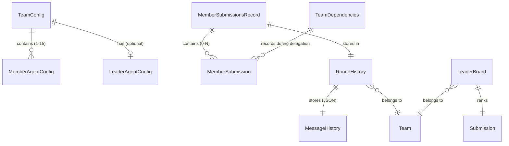
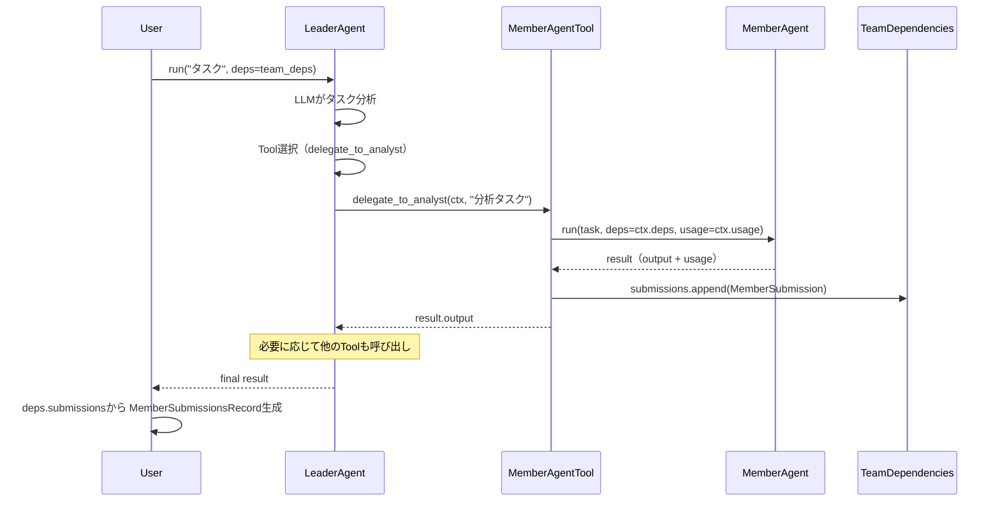
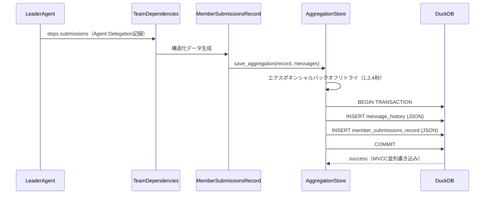

# Data Model: Leader Agent - Agent Delegation と Member Agent応答記録

**Date**: 2025-10-23
**Feature**: 026-mixseek-core-leader
**Phase**: 1 - Data Model & Contracts

## Overview

Leader Agentのデータモデルは、Agent Delegationによる動的なMember Agent選択・実行と、その応答の構造化データ記録を実現します。Pydantic AIの型安全性を最大限活用し、DuckDB JSON型で永続化します。

**設計方針の変更**:
- ❌ 全Member Agent並列実行 → ✅ Agent Delegation（動的選択）
- ❌ `aggregated_content` computed field → ✅ 構造化データのみ（Round Controllerが整形）
- ❌ `AggregatedMemberSubmissions` → ✅ `MemberSubmissionsRecord`（名前変更）

---

## Core Entities

### 1. MemberSubmission

**Purpose**: 個別Member Agentの応答を記録する軽量モデル

**Source**: FR-004（各Member Agent応答にAgent名、種別、実行時間、リソース使用量を含む）

```python
from datetime import datetime, UTC
from pydantic import BaseModel, Field
from pydantic_ai import RunUsage

class MemberSubmission(BaseModel):
    """個別Member Agent応答モデル

    Agent Delegationで実行されたMember Agentの応答と
    メタデータを記録します。
    """

    agent_name: str = Field(
        description="Member Agent名（例: 'analyst', 'web-searcher'）"
    )

    agent_type: str = Field(
        description="Member Agent種別（'plain', 'web-search', 'code-exec'）"
    )

    content: str = Field(
        description="Member Agentの応答テキスト"
    )

    status: str = Field(
        description="実行ステータス（'SUCCESS', 'ERROR'）"
    )

    error_message: str | None = Field(
        default=None,
        description="エラー時のメッセージ（statusがERRORの場合のみ）"
    )

    usage: RunUsage = Field(
        description="Pydantic AI RunUsage（トークン使用量等）"
    )

    timestamp: datetime = Field(
        default_factory=lambda: datetime.now(UTC),
        description="応答生成時刻（UTC）"
    )

    execution_time_ms: float | None = Field(
        default=None,
        description="実行時間（ミリ秒）"
    )
```

**Validation Rules**:
- `agent_name`: 非空文字列
- `agent_type`: enum値（'plain', 'web-search', 'code-exec'）
- `status`: enum値（'SUCCESS', 'ERROR'）
- `usage`: Pydantic AI RunUsage型（型安全性保証）

---

### 2. MemberSubmissionsRecord

**Purpose**: 単一ラウンド内の複数Member Agent応答を構造化データとして記録

**Source**: FR-001（MemberSubmissionsRecordモデルに記録）、FR-003（構造化データとして記録）

```python
from pydantic import BaseModel, Field, computed_field

class MemberSubmissionsRecord(BaseModel):
    """単一ラウンド内のMember Agent応答記録

    Agent Delegationで選択・実行されたMember Agentの
    応答を構造化データとして記録します。
    整形処理（Markdown連結等）はRound Controllerが実施。
    """

    team_id: str = Field(
        description="チームID（例: 'research-team-001'）"
    )

    team_name: str = Field(
        description="チーム名"
    )

    round_number: int = Field(
        ge=1,
        description="ラウンド番号（1から開始）"
    )

    submissions: list[MemberSubmission] = Field(
        default_factory=list,
        description="Agent Delegationで実行されたMember Agent応答（構造化データ）"
    )

    @computed_field
    @property
    def successful_submissions(self) -> list[MemberSubmission]:
        """成功したMember Agent応答のみ（FR-002）"""
        return [s for s in self.submissions if s.status == "SUCCESS"]

    @computed_field
    @property
    def failed_submissions(self) -> list[MemberSubmission]:
        """失敗したMember Agent応答のみ"""
        return [s for s in self.submissions if s.status == "ERROR"]

    @computed_field
    @property
    def total_count(self) -> int:
        """総数"""
        return len(self.submissions)

    @computed_field
    @property
    def success_count(self) -> int:
        """成功数"""
        return len(self.successful_submissions)

    @computed_field
    @property
    def failure_count(self) -> int:
        """失敗数"""
        return len(self.failed_submissions)

    @computed_field
    @property
    def total_usage(self) -> RunUsage:
        """全Member Agentのリソース使用量合計（FR-005）"""
        total_input = sum(s.usage.input_tokens or 0 for s in self.submissions)
        total_output = sum(s.usage.output_tokens or 0 for s in self.submissions)
        total_requests = sum(s.usage.requests or 0 for s in self.submissions)

        return RunUsage(
            input_tokens=total_input,
            output_tokens=total_output,
            requests=total_requests
        )
```

**Validation Rules**:
- `round_number >= 1`
- `submissions`: 空リスト可能（Leader Agentが1つもMember Agentを選択しない場合、Edge Case対応）
- `team_id + round_number`: 組み合わせで一意（FR-008、データベースUNIQUE制約）

**Computed Fields** (動的生成):
- `successful_submissions`: `status == "SUCCESS"`でフィルタ
- `failed_submissions`: `status == "ERROR"`でフィルタ
- `total_count`, `success_count`, `failure_count`: 統計情報
- `total_usage`: 全Member AgentのRunUsage合計（Pydantic AI型）

**Note**: `aggregated_content`フィールドは削除（Round Controllerが整形処理を担当）

---

### 3. TeamConfig (TOML設定モデル)

**Purpose**: チーム設定TOMLファイルの型安全な読み込み

**Source**: FR-029-030（Leader Agentシステムプロンプト）、FR-025（Member Agent参照形式）、FR-032（Tool定義）

```python
from pydantic import BaseModel, Field, field_validator
from pathlib import Path

class LeaderAgentConfig(BaseModel):
    """Leader Agent設定（FR-029-030）"""

    system_prompt: str | None = Field(
        default=None,
        description="Leader Agentシステムプロンプト（未設定時はデフォルト使用）"
    )

    model: str = Field(
        default="openai:gpt-4o",
        description="Leader AgentのLLMモデル"
    )

    temperature: float | None = Field(
        default=None,
        ge=0.0,
        le=2.0,
        description="Temperature設定（0.0-2.0、Noneの場合はモデルのデフォルト値を使用）"
    )

    max_tokens: int | None = Field(
        default=None,
        gt=0,
        description="最大トークン数（Noneの場合はモデルのデフォルト値を使用）"
    )

    timeout_seconds: int | None = Field(
        default=300,
        ge=10,
        le=600,
        description="HTTPタイムアウト（秒、デフォルト: 300秒 / 5分）"
    )

    max_retries: int = Field(
        default=3,
        ge=0,
        description="LLM API呼び出しの最大リトライ回数"
    )

    stop_sequences: list[str] | None = Field(
        default=None,
        description="生成を停止するシーケンスのリスト"
    )

    top_p: float | None = Field(
        default=None,
        ge=0.0,
        le=1.0,
        description="Top-pサンプリングパラメータ（Noneの場合はモデルのデフォルト値）"
    )

    seed: int | None = Field(
        default=None,
        description="ランダムシード（OpenAI/Geminiでサポート、Anthropicでは非サポート）"
    )

    @field_validator("system_prompt")
    @classmethod
    def validate_system_prompt(cls, v: str | None) -> str | None:
        """システムプロンプトバリデーション（Edge Case対応）"""
        if v is not None and not v.strip():
            raise ValueError(
                "system_prompt cannot be empty string. "
                "Use None for default prompt or provide valid text."
            )
        return v


class MemberAgentConfig(BaseModel):
    """Member Agent設定（インライン定義または参照形式、FR-025）"""

    agent_name: str = Field(
        description="Member Agent名（チーム内で一意）"
    )

    agent_type: str = Field(
        description="Agent種別（'plain', 'web-search', 'code-exec'）"
    )

    # Agent Delegation Tool設定（FR-032）
    tool_name: str | None = Field(
        default=None,
        description="Leader AgentのTool名（未設定時は'delegate_to_{agent_name}'に自動生成）"
    )

    tool_description: str = Field(
        description="Toolの説明（Leader Agentが選択時に参照）"
    )

    model: str = Field(
        description="LLMモデル（例: 'gemini-2.5-flash-lite'）"
    )

    system_instruction: str | None = Field(
        default=None,
        description="システム指示（Noneの場合はデフォルト指示を自動適用）"
    )

    system_prompt: str | None = Field(
        default=None,
        description="システムプロンプト（Pydantic AIのsystem_prompt、system_instructionと併用可能）"
    )

    temperature: float | None = Field(
        default=None,
        ge=0.0,
        le=2.0,
        description="Temperature（0.0-2.0、Noneの場合はモデルのデフォルト値を使用）"
    )

    max_tokens: int | None = Field(
        default=None,
        gt=0,
        description="最大トークン数（Noneの場合はモデルのデフォルト値を使用）"
    )

    timeout_seconds: int | None = Field(
        default=None,
        ge=0,
        description="タイムアウト（秒）"
    )

    max_retries: int = Field(
        default=3,
        ge=0,
        description="LLM API呼び出しの最大リトライ回数"
    )

    stop_sequences: list[str] | None = Field(
        default=None,
        description="生成を停止するシーケンスのリスト"
    )

    top_p: float | None = Field(
        default=None,
        ge=0.0,
        le=1.0,
        description="Top-pサンプリングパラメータ（Noneの場合はモデルのデフォルト値）"
    )

    seed: int | None = Field(
        default=None,
        description="ランダムシード（OpenAI/Geminiでサポート、Anthropicでは非サポート）"
    )

    # 参照形式サポート（FR-025、DRY Article 10）
    config: str | None = Field(
        default=None,
        description="既存Member Agent TOMLファイルパス（参照形式）"
    )

    @field_validator("tool_description")
    @classmethod
    def validate_tool_description(cls, v: str) -> str:
        """Tool説明バリデーション"""
        if not v.strip():
            raise ValueError("tool_description cannot be empty")
        return v

    def get_tool_name(self) -> str:
        """Tool名を取得（自動生成対応、Edge Case）"""
        return self.tool_name or f"delegate_to_{self.agent_name}"


class TeamConfig(BaseModel):
    """チーム設定（TOML設定ファイル）"""

    team_id: str = Field(
        description="チームID（一意）"
    )

    team_name: str = Field(
        description="チーム名"
    )

    max_concurrent_members: int = Field(
        default=15,
        ge=1,
        le=50,
        description="最大Member Agent数（デフォルト15、親仕様FR-014）"
    )

    leader: LeaderAgentConfig = Field(
        default_factory=LeaderAgentConfig,
        description="Leader Agent設定（デフォルト値でインスタンス化、FR-030）"
    )

    members: list[MemberAgentConfig] = Field(
        default_factory=list,
        description="Member Agent設定リスト（0件の場合はLeader Agent単独実行）"
    )

    @field_validator("members")
    @classmethod
    def validate_member_count(cls, v: list[MemberAgentConfig], info) -> list[MemberAgentConfig]:
        """Member Agent数の上限チェック"""
        max_count = info.data.get("max_concurrent_members", 15)
        if len(v) > max_count:
            raise ValueError(
                f"Too many members: {len(v)} > {max_count}. "
                f"Adjust max_concurrent_members or reduce member count."
            )
        return v

    @field_validator("members")
    @classmethod
    def validate_unique_agent_names(cls, v: list[MemberAgentConfig]) -> list[MemberAgentConfig]:
        """agent_name重複チェック"""
        names = [m.agent_name for m in v]
        if len(names) != len(set(names)):
            duplicates = [name for name in names if names.count(name) > 1]
            raise ValueError(f"Duplicate agent_name detected: {duplicates}")
        return v

    @field_validator("members")
    @classmethod
    def validate_unique_tool_names(cls, v: list[MemberAgentConfig]) -> list[MemberAgentConfig]:
        """tool_name重複チェック（Edge Case対応）"""
        tool_names = [m.get_tool_name() for m in v]
        if len(tool_names) != len(set(tool_names)):
            duplicates = [name for name in tool_names if tool_names.count(name) > 1]
            raise ValueError(f"Duplicate tool_name detected: {duplicates}")
        return v
```

---

### 4. TeamDependencies (RunContext依存関係)

**Purpose**: Agent Delegation時に共有する依存関係

**Source**: FR-034（ctx.usage統合）、Agent Delegation標準パターン

```python
from dataclasses import dataclass, field

@dataclass
class TeamDependencies:
    """Leader Agent実行時の依存関係

    Agent Delegationで各Member Agentに共有される
    依存関係オブジェクト。RunContext[TeamDependencies]として使用。
    """

    team_id: str
    team_name: str
    round_number: int

    # Member Agent応答を記録するリスト（mutable、FR-031）
    submissions: list[MemberSubmission] = field(default_factory=list)

    # 共有リソース（必要に応じて追加）
    # db_store: AggregationStore
    # http_client: httpx.AsyncClient
```

**Usage in Agent Delegation**:
```python
# 初期化
deps = TeamDependencies(
    team_id="research-team-001",
    team_name="Advanced Research Team",
    round_number=1
)

# Leader Agent実行（Agent Delegationで自動的にMember Agent選択・実行）
result = await leader_agent.run(
    "最新のAI技術トレンドを分析してください",
    deps=deps
)

# deps.submissionsに選択されたMember Agent応答が記録される
record = MemberSubmissionsRecord(
    team_id=deps.team_id,
    team_name=deps.team_name,
    round_number=deps.round_number,
    submissions=deps.submissions
)
```

---

## Database Schema

### RoundHistory Table (FR-006, FR-007, FR-007-1)

**Purpose**: チーム×ラウンドごとのMessage HistoryとMember Agent応答を永続化

**DDL** (DuckDB):
```sql
-- シーケンス作成（IDENTITY代替）
CREATE SEQUENCE IF NOT EXISTS round_history_id_seq;

CREATE TABLE IF NOT EXISTS round_history (
    id INTEGER PRIMARY KEY DEFAULT nextval('round_history_id_seq'),

    -- チーム識別
    team_id TEXT NOT NULL,
    team_name TEXT NOT NULL,
    round_number INTEGER NOT NULL,

    -- Pydantic AI Message History（JSON型、FR-006）
    message_history JSON,

    -- Member Agent応答記録（JSON型、FR-007）
    -- 注: aggregated_submissions → member_submissions_record に変更
    member_submissions_record JSON,

    -- メタデータ
    created_at TIMESTAMP DEFAULT CURRENT_TIMESTAMP,

    -- 一意性制約（FR-008）
    UNIQUE(team_id, round_number)
);

-- インデックス（読み取り最適化）
CREATE INDEX IF NOT EXISTS idx_round_history_team
ON round_history(team_id, round_number);
```

**Columns**:
- `id`: 自動インクリメントID（シーケンス使用、Clarifications 2025-10-23）
- `team_id`, `round_number`: 複合一意キー
- `message_history`: Pydantic AI Message History（JSON型）
- `member_submissions_record`: MemberSubmissionsRecord（JSON型）
- `created_at`: 作成日時（自動設定）

**Constraints**:
- UNIQUE(team_id, round_number): 同一チーム・同一ラウンドの重複保存を防ぐ（UPSERT可能、Edge Case対応）

**Transaction Scope** (FR-007-1):
- `message_history`と`member_submissions_record`は**単一トランザクション**で保存
- データ整合性保証（片方のみ保存される不整合を防ぐ）

---

### LeaderBoard Table (FR-010, FR-011)

**Purpose**: Submission評価結果のランキング管理

**DDL** (DuckDB):
```sql
-- シーケンス作成
CREATE SEQUENCE IF NOT EXISTS leader_board_id_seq;

CREATE TABLE IF NOT EXISTS leader_board (
    id INTEGER PRIMARY KEY DEFAULT nextval('leader_board_id_seq'),

    -- チーム識別
    team_id TEXT NOT NULL,
    team_name TEXT NOT NULL,
    round_number INTEGER NOT NULL,

    -- 評価結果
    evaluation_score DOUBLE NOT NULL CHECK (evaluation_score >= 0.0 AND evaluation_score <= 1.0),
    evaluation_feedback TEXT,

    -- Submission内容
    submission_content TEXT NOT NULL,
    submission_format TEXT DEFAULT 'structured_json',  -- 'markdown' → 'structured_json'に変更

    -- リソース使用量（JSON型）
    usage_info JSON,

    -- メタデータ
    created_at TIMESTAMP DEFAULT CURRENT_TIMESTAMP
);

-- インデックス（ランキングクエリ最適化、FR-011）
CREATE INDEX IF NOT EXISTS idx_leader_board_score
ON leader_board(evaluation_score DESC, created_at ASC);
```

**Columns**:
- `evaluation_score`: 0.0-1.0の範囲（CHECK制約）
- `submission_content`: Submission内容（構造化JSON形式、Round Controllerが整形前のデータを保存）
- `submission_format`: 'structured_json'（従来の'markdown'から変更）
- `usage_info`: RunUsage情報（JSON型）

**Indexes** (FR-011):
- `(evaluation_score DESC, created_at ASC)`: スコア降順、同スコアは作成日時早い順

---

## Relationships



**Key Relationships**:
1. TeamConfig → MemberAgentConfig: 1対多（最低1、最大15）
2. TeamConfig → LeaderAgentConfig: 1対0..1（オプション、FR-030）
3. MemberSubmissionsRecord → MemberSubmission: 1対多（Agent Delegationで選択された応答、0件も可能）
4. RoundHistory: team_id + round_number で一意
5. TeamDependencies → MemberSubmission: Agent Delegation実行時に動的に記録

---

## Data Flow

### 1. Agent Delegation実行フロー



### 2. データ永続化フロー（単一トランザクション）



---

## JSON Schema

### MemberSubmissionsRecord JSON例

```json
{
  "team_id": "research-team-001",
  "team_name": "Advanced Research Team",
  "round_number": 1,
  "submissions": [
    {
      "agent_name": "analyst",
      "agent_type": "plain",
      "content": "データ分析の結果、以下の傾向が見られました...",
      "status": "SUCCESS",
      "error_message": null,
      "usage": {
        "input_tokens": 150,
        "output_tokens": 300,
        "requests": 1
      },
      "timestamp": "2025-10-23T10:30:45.123456Z",
      "execution_time_ms": 1234.5
    },
    {
      "agent_name": "web-searcher",
      "agent_type": "web-search",
      "content": "最新情報の検索結果...",
      "status": "SUCCESS",
      "error_message": null,
      "usage": {
        "input_tokens": 100,
        "output_tokens": 200,
        "requests": 1
      },
      "timestamp": "2025-10-23T10:30:50.789012Z",
      "execution_time_ms": 2345.6
    }
  ]
}
```

**Notes**:
- `successful_submissions`, `total_usage`等のcomputed fieldsはJSON出力に含まれない（動的生成）
- DuckDBに保存時、このJSON構造がそのまま`member_submissions_record`カラムに保存される
- Round Controllerが読み込み時、`submissions`リストから必要な形式に整形（Markdown連結、表形式等）

---

## Validation & Constraints Summary

| Entity | Key Constraints |
|--------|----------------|
| MemberSubmission | status IN ('SUCCESS', 'ERROR'), usage型必須（Pydantic AI RunUsage） |
| MemberSubmissionsRecord | round_number >= 1, team_id+round一意, submissions空リスト可能 |
| TeamConfig | members最低1つ・最大15、agent_name一意、tool_name一意（自動生成含む） |
| LeaderAgentConfig | system_prompt空文字列不可（None可） |
| RoundHistory (DB) | UNIQUE(team_id, round_number), 単一トランザクション保存 |
| LeaderBoard (DB) | evaluation_score BETWEEN 0.0 AND 1.0 |

---

## Migration from Existing Code

### 既存実装（`src/mixseek/storage/aggregation_store.py`）

#### DRY調査結果
✅ **既存の`AggregationStore`クラスを最大限再利用**

**再利用可能な機能**:
- `_get_connection()`: スレッドローカル接続管理
- `_transaction()`: トランザクション管理コンテキストマネージャ
- `_get_db_path()`: 環境変数`MIXSEEK_WORKSPACE`からパス取得（Article 9準拠）
- `save_aggregation()`: エクスポネンシャルバックオフリトライ実装済み
- `load_round_history()`: Message History復元ロジック
- `get_leader_board()`, `get_team_statistics()`: 分析クエリ

#### 必要な変更（Article 11: Refactoring Policy準拠）
1. **モデル名変更**: `AggregatedMemberSubmissions` → `MemberSubmissionsRecord`
   - V2クラス作成禁止、既存クラスを直接修正
2. **スキーマ更新**: `aggregated_submissions`カラム → `member_submissions_record`
   - DuckDB側も同時に変更
3. **Agent Delegation対応**: Tool実行記録の追加
   - `ctx.deps.submissions.append()`パターン追加

#### 互換性
- ✅ JSON構造は互換性あり（フィールド削除のみ、追加なし）
- ✅ DuckDB既存データは読み込み可能
- ✅ 既存テストは最小限の修正で再利用可能

---

## Summary

- **主要エンティティ**: MemberSubmission, MemberSubmissionsRecord, TeamConfig (LeaderAgentConfig + MemberAgentConfig), TeamDependencies
- **データベーステーブル**: RoundHistory, LeaderBoard
- **型安全性**: すべてPydantic BaseModel、Pydantic AI RunUsage型
- **JSON互換**: DuckDB JSON型で完全永続化、`ModelMessagesTypeAdapter`で往復変換
- **Agent Delegation対応**: Tool名・説明の動的生成、`ctx.usage`統合
- **DRY準拠**: 既存`AggregationStore`クラス最大限再利用、Article 11準拠のリファクタリング

**変更の本質**:
- Leader Agentは「記録」のみ担当（整形はRound Controller）
- Agent Delegationで動的選択（全Agent並列実行を破棄）
- 構造化データ中心（Pydantic AIの型安全性最大活用）

**Next**: contracts/生成（API契約定義、データベーススキーマDDL）
