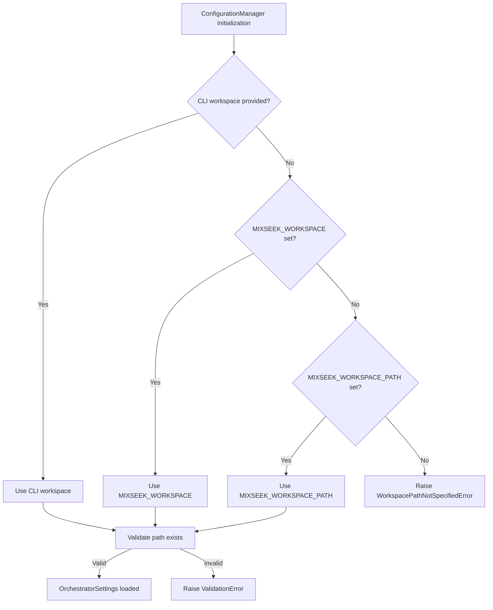

# Environment Variable Priority: MIXSEEK_WORKSPACE vs MIXSEEK_WORKSPACE_PATH

**Date**: 2025-11-12 (Updated)
**Branch**: 051-configuration
**Checklist Item**: CHK029
**Purpose**: Clarify priority and behavior when both environment variables are set

---

## Executive Summary

**Recommendation**: Use **`MIXSEEK_WORKSPACE`** for all configurations (primary environment variable).

**Priority Order** (highest to lowest):
1. CLI argument (`--workspace`)
2. `MIXSEEK_WORKSPACE` environment variable (**PRIMARY** - recommended for all users)
3. `MIXSEEK_WORKSPACE_PATH` environment variable (technical alternative, not recommended)
4. Error raised (no implicit fallback)

**Important**: While both environment variables are technically supported, **`MIXSEEK_WORKSPACE`** is the primary and recommended variable for all documentation, scripts, and user guidance.

---

## Background

### Historical Context

**Before 051-configuration**:
- Only `MIXSEEK_WORKSPACE` was supported
- Direct `os.environ["MIXSEEK_WORKSPACE"]` access throughout codebase
- Implicit fallbacks to `Path.cwd()` in some places (Article 9 violation)

**After 051-configuration** (Phase 12):
- `MIXSEEK_WORKSPACE` remains the primary environment variable
- `MIXSEEK_WORKSPACE_PATH` exists for pydantic-settings naming convention
- All access centralized through ConfigurationManager
- No implicit fallbacks (Article 9 compliant)

### Why Two Environment Variables Exist?

**`MIXSEEK_WORKSPACE`** (Primary - **USE THIS**):
- **Official environment variable** for mixseek-core
- Used in all documentation (docs/, CLAUDE.md, quickstart.md)
- Shorter, more convenient for CLI usage
- **Recommended for all users** (new and existing)

**`MIXSEEK_WORKSPACE_PATH`** (Technical Alternative - **NOT RECOMMENDED**):
- Exists due to pydantic-settings automatic field mapping
- `OrchestratorSettings` has `workspace_path: Path` field
- pydantic-settings auto-maps `workspace_path` → `MIXSEEK_WORKSPACE_PATH` with `env_prefix="MIXSEEK_"`
- **Not documented in user-facing guides**
- **Use only if you have specific technical requirements**

**Design Decision**: The project prioritizes user experience and documentation consistency over pydantic-settings naming conventions. Therefore, `MIXSEEK_WORKSPACE` is explicitly preferred through manual fallback logic.

---

## Detailed Priority Rules

### Priority Level 1: CLI Argument (Highest)

**Source**: `--workspace` or `-w` command-line flag

**Applicable Commands**:
- `mixseek exec --workspace /path/to/workspace`
- `mixseek team --workspace /path/to/workspace --config team.toml`
- `mixseek evaluate --workspace /path/to/workspace`
- `mixseek config list --workspace /path/to/workspace`
- `mixseek ui --workspace /path/to/workspace`

**Behavior**:
- **Always** takes priority over environment variables
- Explicit user intent at execution time
- Validated immediately (path must exist and be a directory)

**Example**:
```bash
# Environment variables are ignored when --workspace is provided
export MIXSEEK_WORKSPACE=/env/path
mixseek exec --workspace /cli/path --config team.toml prompt "..."
# Uses: /cli/path
```

---

### Priority Level 2: MIXSEEK_WORKSPACE (Primary - **RECOMMENDED**)

**Source**: `MIXSEEK_WORKSPACE` environment variable

**Recognition**: Manual fallback in `OrchestratorSettings.validate_required_fields()`
- Checks `os.getenv("MIXSEEK_WORKSPACE")` if `workspace_path` not in values
- Assigns to `workspace_path` field for consistency
- See: `src/mixseek/config/schema.py:495-499`

**Behavior**:
- Used when CLI `--workspace` is not provided
- **Primary environment variable** for all users
- Validated on ConfigurationManager initialization

**Documentation**:
- ✅ Used in all `docs/` guides
- ✅ Used in `docs/quickstart.md`
- ✅ Used in `CLAUDE.md`
- ✅ Used in `docs/configuration-reference.md`

**Example**:
```bash
export MIXSEEK_WORKSPACE=/path/to/workspace
mixseek exec --config team.toml prompt "..."
# Uses: /path/to/workspace
```

---

### Priority Level 3: MIXSEEK_WORKSPACE_PATH (Technical Alternative - **NOT RECOMMENDED**)

**Source**: `MIXSEEK_WORKSPACE_PATH` environment variable

**Recognition**: Automatic via pydantic-settings
- `OrchestratorSettings` has `workspace_path: Path` field
- `env_prefix = "MIXSEEK_"` in `model_config`
- pydantic-settings auto-maps `workspace_path` → `MIXSEEK_WORKSPACE_PATH`

**Behavior**:
- Used when both CLI `--workspace` and `MIXSEEK_WORKSPACE` are not set
- **Not documented** in user-facing guides
- Exists for technical consistency with pydantic-settings conventions

**Why Not Recommended**:
- Inconsistent with project documentation (all examples use `MIXSEEK_WORKSPACE`)
- Longer and less convenient than `MIXSEEK_WORKSPACE`
- May confuse users who follow official guides

**Example** (not recommended):
```bash
# This works, but is NOT recommended
export MIXSEEK_WORKSPACE_PATH=/path/to/workspace
mixseek exec --config team.toml prompt "..."
# Uses: /path/to/workspace
```

**If You're Using This**: Consider migrating to `MIXSEEK_WORKSPACE` for consistency with documentation.

---

### Priority Level 4: Error (No Implicit Fallback)

**Behavior**: `WorkspacePathNotSpecifiedError` raised

**Error Message** (Article 9 compliant):
```
MIXSEEK_WORKSPACE または MIXSEEK_WORKSPACE_PATH の明示的な設定が必要です。
環境変数またはTOMLファイル（workspace_path）で設定してください。
```

**Applicable Scenarios**:
- No CLI argument
- No `MIXSEEK_WORKSPACE` environment variable
- No `MIXSEEK_WORKSPACE_PATH` environment variable
- Empty string values (treated as unset)

**Example**:
```bash
# No workspace specified
unset MIXSEEK_WORKSPACE
unset MIXSEEK_WORKSPACE_PATH
mixseek exec --config team.toml prompt "..."
# Error: WorkspacePathNotSpecifiedError
```

---

## When Both Environment Variables Are Set

### Scenario: Conflicting Values

```bash
export MIXSEEK_WORKSPACE=/primary/path
export MIXSEEK_WORKSPACE_PATH=/alternative/path
```

### Actual Behavior (Implementation Detail)

**Technical Priority**: `MIXSEEK_WORKSPACE` wins (manual fallback overrides pydantic auto-mapping)

**Rationale**:
- `validate_required_fields()` explicitly checks `MIXSEEK_WORKSPACE` and sets `workspace_path`
- This happens **before** pydantic-settings processes `MIXSEEK_WORKSPACE_PATH`
- Design choice: prioritize user-facing variable over technical convention

**Validation**:
```python
from mixseek.config import ConfigurationManager, OrchestratorSettings

# Both environment variables set
import os
os.environ["MIXSEEK_WORKSPACE"] = "/primary/path"
os.environ["MIXSEEK_WORKSPACE_PATH"] = "/alternative/path"

config_manager = ConfigurationManager(workspace=None)
settings = config_manager.load_settings(OrchestratorSettings)

print(settings.workspace_path)
# Output: /primary/path (MIXSEEK_WORKSPACE wins)
```

### Recommendation

**Avoid setting both variables**. Use only `MIXSEEK_WORKSPACE`:

```bash
# Good - Clear and consistent
export MIXSEEK_WORKSPACE=/path/to/workspace

# Bad - Confusing and unnecessary
export MIXSEEK_WORKSPACE=/path/to/workspace
export MIXSEEK_WORKSPACE_PATH=/path/to/workspace
```

---

## Implementation Details

### Code Location

**Priority Implementation**:
```
src/mixseek/config/schema.py
├── Line 448-451: workspace_path field definition
├── Line 475-504: validate_required_fields() - MIXSEEK_WORKSPACE manual fallback
└── Line 506-514: validate_workspace() - path validation
```

**Constants**:
```
src/mixseek/config/constants.py
└── Line 9: WORKSPACE_ENV_VAR = "MIXSEEK_WORKSPACE" (primary variable name)
```

### Validation Flow



---

## User Guidance

### Recommended Practice

**For All Users** (new and existing):
```bash
# Use MIXSEEK_WORKSPACE (official, documented, recommended)
export MIXSEEK_WORKSPACE=/path/to/workspace
```

**For Development**:
```bash
# Use CLI argument for quick testing (highest priority)
mixseek exec --workspace /tmp/test-workspace --config team.toml prompt "..."
```

### If You're Using MIXSEEK_WORKSPACE_PATH

**Current Status**: You're using an undocumented technical variable.

**Recommendation**: Migrate to `MIXSEEK_WORKSPACE` for consistency with documentation.

**Migration Steps**:

**Step 1**: Check current usage
```bash
echo "MIXSEEK_WORKSPACE: $MIXSEEK_WORKSPACE"
echo "MIXSEEK_WORKSPACE_PATH: $MIXSEEK_WORKSPACE_PATH"
```

**Step 2**: Update environment variables
```bash
# If using MIXSEEK_WORKSPACE_PATH
export MIXSEEK_WORKSPACE=$MIXSEEK_WORKSPACE_PATH
unset MIXSEEK_WORKSPACE_PATH

# Or update .env file
sed -i 's/MIXSEEK_WORKSPACE_PATH=/MIXSEEK_WORKSPACE=/g' .env
```

**Step 3**: Update scripts
```bash
# Search for MIXSEEK_WORKSPACE_PATH in scripts
grep -r "MIXSEEK_WORKSPACE_PATH" scripts/

# Replace with MIXSEEK_WORKSPACE
sed -i 's/MIXSEEK_WORKSPACE_PATH/MIXSEEK_WORKSPACE/g' scripts/*.sh
```

**Why Migrate**:
- ✅ Consistency with all official documentation
- ✅ Shorter, more convenient variable name
- ✅ Matches what other users and AI assistants expect
- ✅ Aligns with project conventions

---

## Rationale: Why MIXSEEK_WORKSPACE is Primary

### User Experience

1. **Documentation Consistency**: All guides use `MIXSEEK_WORKSPACE`
2. **Brevity**: Shorter variable name (`MIXSEEK_WORKSPACE` vs `MIXSEEK_WORKSPACE_PATH`)
3. **Historical Continuity**: Existing users already use `MIXSEEK_WORKSPACE`
4. **AI Assistant Expectations**: Claude Code and other AI tools expect `MIXSEEK_WORKSPACE` based on documentation

### Technical Considerations

1. **Pydantic-settings Convention**: While `MIXSEEK_WORKSPACE_PATH` follows pydantic's automatic mapping (`env_prefix + field_name`), user experience trumps technical convention
2. **Explicit Over Implicit**: Manual fallback logic explicitly prioritizes `MIXSEEK_WORKSPACE`
3. **Backward Compatibility**: Maintains compatibility with pre-051-configuration setups

### Design Philosophy

**Constitution Article 9**: Data Accuracy Mandate
- ✅ No implicit fallbacks (both variables require explicit setting)
- ✅ Clear error messages when neither is set
- ✅ Explicit priority order (not ambiguous)

**User-First Approach**:
- Prioritize what users see in documentation
- Minimize cognitive load (one primary variable, not two equal options)
- Clear migration path if using technical alternative

---

## Summary Table

| Aspect | MIXSEEK_WORKSPACE | MIXSEEK_WORKSPACE_PATH |
|--------|-------------------|------------------------|
| **Status** | ✅ Primary (Recommended) | ⚠️ Technical Alternative (Not Recommended) |
| **Documentation** | ✅ All guides | ❌ Not documented |
| **Priority** | 🥇 2nd (after CLI) | 🥉 3rd (fallback) |
| **Length** | Shorter (18 chars) | Longer (23 chars) |
| **Use Case** | All users | Technical edge cases only |
| **Recognition** | Manual fallback | pydantic-settings auto |
| **Recommendation** | **USE THIS** | Avoid unless necessary |

---

## Related Documents

- [Spec: FR-003](../spec.md#fr-003-environment-variables) - Environment Variable Configuration
- [Quickstart: Environment Setup](../../docs/quickstart.md) - Getting Started Guide (uses MIXSEEK_WORKSPACE)
- [Configuration Reference](../../docs/configuration-reference.md) - Complete config guide (uses MIXSEEK_WORKSPACE)
- [Implementation Report](./legacy-config-implementation-report.md) - Migration Status
- [Article 9 Violations](./article9-violations-detailed.md) - CHK050 Complete List

---

## Changelog

### 2025-11-12: Corrected Priority Documentation
- **Corrected**: `MIXSEEK_WORKSPACE` is primary (not `MIXSEEK_WORKSPACE_PATH`)
- Clarified that `MIXSEEK_WORKSPACE_PATH` is technical alternative, not recommended
- Updated priority order: `MIXSEEK_WORKSPACE` > `MIXSEEK_WORKSPACE_PATH` (not reverse)
- Added migration guide for `MIXSEEK_WORKSPACE_PATH` users
- Aligned with all official documentation (docs/, CLAUDE.md)

### Future Work

1. **Update CLAUDE.md** (Immediate):
   - Correct environment variable section to use `MIXSEEK_WORKSPACE` as primary
   - Remove or de-emphasize `MIXSEEK_WORKSPACE_PATH`

2. **Consider Deprecating MIXSEEK_WORKSPACE_PATH** (v2.0):
   - Remove pydantic auto-mapping for `MIXSEEK_WORKSPACE_PATH`
   - Use only `MIXSEEK_WORKSPACE` for clarity
   - Add migration warning in v1.x

---

**Report Generated**: 2025-11-12 (Corrected)
**Tool Versions**: Python 3.13.7, pydantic-settings 2.12.0
**Reviewed By**: Claude Code (AI)
**Status**: ✅ CHK029 Complete (Corrected)
