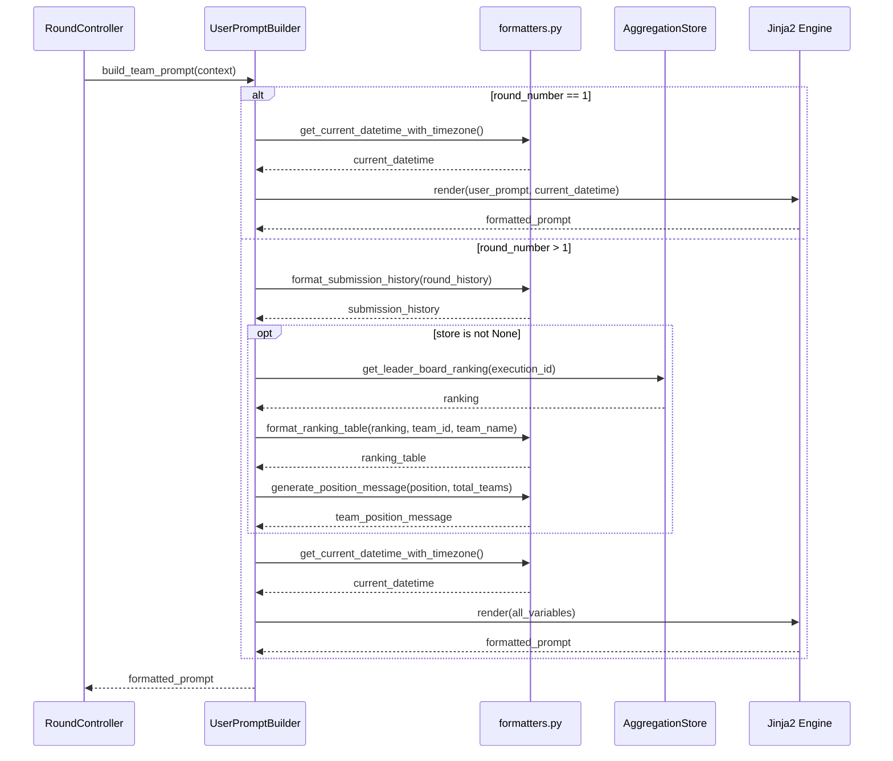

# API Contract: UserPromptBuilder

**Feature**: 092-user-prompt-builder-team
**Date**: 2025-11-19
**Status**: Phase 1 Design

このドキュメントは、UserPromptBuilderの公開APIインターフェースを定義します。

---

## 1. UserPromptBuilder クラス

### 1.1 初期化

```python
class UserPromptBuilder:
    """プロンプト整形を担当するコンポーネント

    Jinja2テンプレートエンジンを使用し、TOML設定ファイルから
    team_user_promptを読み込む。Leader Boardランキングの取得機能を内蔵する。
    """

    def __init__(
        self,
        workspace: Path,
        store: AggregationStore | None = None,
    ) -> None:
        """UserPromptBuilderインスタンスを初期化する

        Args:
            workspace: ワークスペースディレクトリパス（$MIXSEEK_WORKSPACE）
            store: DuckDBストア（Leader Board取得用）。Noneの場合はランキング情報なし

        Raises:
            FileNotFoundError: ワークスペースが存在しない場合
            ValidationError: 設定ファイルのバリデーションエラー
        """
```

**事前条件**:
- `workspace` は有効な絶対パスである
- `workspace/configs/prompt_builder.toml` が存在するか、デフォルト値が使用可能である

**事後条件**:
- `PromptBuilderSettings` が正常に読み込まれる
- Jinja2 `Environment` が初期化される

---

### 1.2 build_team_prompt メソッド（メインAPI）

```python
async def build_team_prompt(
    self,
    context: RoundPromptContext,
) -> str:
    """Teamに渡すプロンプトを整形する

    Args:
        context: プロンプト生成に必要なコンテキスト情報

    Returns:
        整形済みプロンプト文字列

    Raises:
        ValidationError: contextのバリデーションエラー
        TemplateError: Jinja2テンプレートの構文エラー
        ValueError: 環境変数TZが不正な値の場合
    """
```

**入力**:
- `context: RoundPromptContext` (data-model.md参照)

**出力**:
- `str`: 整形済みプロンプト文字列

**処理フロー**:



**例外処理**:

| 例外 | 発生条件 | エラーメッセージ例 |
|------|---------|------------------|
| `ValidationError` | `context`のバリデーションエラー | "round_number must be >= 1" |
| `TemplateError` | Jinja2テンプレートの構文エラー | "Jinja2 template syntax error at line 5: ..." |
| `ValueError` | 環境変数TZが不正 | "Invalid timezone in TZ environment variable: Invalid/Timezone" |
| `ZoneInfoNotFoundError` | タイムゾーンが見つからない | （ValueErrorにラップされる） |

---

## 2. フォーマッター関数（formatters.py）

### 2.1 format_submission_history

```python
def format_submission_history(round_history: list[RoundState]) -> str:
    """過去のSubmission履歴を整形する

    Args:
        round_history: 過去のラウンド履歴（すべてのラウンド）

    Returns:
        整形済み履歴文字列。履歴がない場合は「まだ過去のSubmissionはありません。」

    Example:
        >>> history = [
        ...     RoundState(round_number=1, submission_content="...",
        ...                evaluation_score=75.5, score_details={"accuracy": 80.0},
        ...                round_started_at=datetime.now(), round_ended_at=datetime.now())
        ... ]
        >>> print(format_submission_history(history))
        ## ラウンド 1
        スコア: 75.50/100
        スコア詳細:
        {
          "accuracy": 80.0
        }
        あなたの提出内容: ...
    """
```

**入力**: `list[RoundState]`

**出力**: `str`

**出力形式**:

```
## ラウンド {round_number}
スコア: {score:.2f}/100
スコア詳細:
{score_details (JSON format)}
あなたの提出内容: {content}

## ラウンド {round_number}
...
```

**エッジケース**:
- 履歴が空（`len(round_history) == 0`）: 「まだ過去のSubmissionはありません。」を返す

---

### 2.2 format_ranking_table

```python
def format_ranking_table(
    ranking: list[dict[str, Any]],
    team_id: str,
    team_name: str,
) -> str:
    """Leader Boardランキングを整形する

    Args:
        ranking: Leader Boardから取得したランキング情報
                 各要素: {"team_id": str, "team_name": str, "max_score": float, "total_rounds": int}
        team_id: 当該チームのID
        team_name: 当該チームの名前

    Returns:
        整形済みランキング表。ランキングが空の場合は「現在はランキング情報がありません。」

    Example:
        >>> ranking = [
        ...     {"team_id": "team1", "team_name": "Alpha", "max_score": 85.5, "total_rounds": 3},
        ...     {"team_id": "team2", "team_name": "Beta", "max_score": 80.0, "total_rounds": 2},
        ... ]
        >>> print(format_ranking_table(ranking, "team1", "Alpha"))
        **#1 Alpha (あなたのチーム) - スコア: 85.50/100 (ラウンド数: 3)**
        #2 Beta - スコア: 80.00/100 (ラウンド数: 2)
    """
```

**入力**:
- `ranking: list[dict]`
- `team_id: str`
- `team_name: str`

**出力**: `str`

**出力形式**:

```
**#{rank} {team_name} (あなたのチーム) - スコア: {max_score:.2f}/100 (ラウンド数: {total_rounds})**
#{rank} {team_name} - スコア: {max_score:.2f}/100 (ラウンド数: {total_rounds})
...
```

**エッジケース**:
- ランキングが空（`len(ranking) == 0`）: 「現在はランキング情報がありません。」を返す

---

### 2.3 generate_position_message

```python
def generate_position_message(position: int, total_teams: int) -> str:
    """チーム順位メッセージを生成する

    Args:
        position: 当該チームの順位（1以上）
        total_teams: 総チーム数

    Returns:
        順位に応じたメッセージ

    Raises:
        ValueError: positionまたはtotal_teamsが不正な値の場合

    Example:
        >>> generate_position_message(1, 5)
        "🏆 現在、あなたのチームは1位です！この調子で頑張ってください。"
        >>> generate_position_message(2, 5)
        "現在、5チーム中2位です。素晴らしい成績です！"
        >>> generate_position_message(4, 5)
        "現在、5チーム中4位です。"
    """
```

**入力**:
- `position: int` (1以上)
- `total_teams: int` (1以上)

**出力**: `str`

**出力パターン**:

| 順位 | メッセージ |
|------|----------|
| 1位 | 「🏆 現在、あなたのチームは1位です！この調子で頑張ってください。」 |
| 2-3位 | 「現在、{total_teams}チーム中{position}位です。素晴らしい成績です！」 |
| 4位以下 | 「現在、{total_teams}チーム中{position}位です。」 |

**バリデーション**:
- `position < 1` または `position > total_teams`: `ValueError("Invalid position")`
- `total_teams < 1`: `ValueError("Invalid total_teams")`

---

### 2.4 get_current_datetime_with_timezone

```python
def get_current_datetime_with_timezone() -> str:
    """環境変数TZに基づく現在日時を取得する（ISO 8601形式）

    環境変数TZが設定されていない場合はUTCをデフォルト使用する。

    Returns:
        ISO 8601形式の現在日時文字列（タイムゾーン付き）

    Raises:
        ValueError: TZ環境変数が不正な値の場合

    Example:
        >>> # TZ未設定の場合
        >>> get_current_datetime_with_timezone()
        "2025-11-19T12:34:56.789012+00:00"

        >>> # TZ="Asia/Tokyo"の場合
        >>> get_current_datetime_with_timezone()
        "2025-11-19T21:34:56.789012+09:00"
    """
```

**入力**: なし（環境変数TZを参照）

**出力**: `str` (ISO 8601形式)

**Article 9準拠**:
- 環境変数TZから明示的に取得
- TZ未設定時はUTCをデフォルト使用（暗黙的フォールバックなし）
- 不正なTZ値の場合は明確なエラーメッセージとともに例外を発生

---

## 3. エラーハンドリング

### 3.1 エラー階層

```
Exception
├── ValidationError (Pydantic)
│   ├── PromptBuilderSettings validation error
│   └── RoundPromptContext validation error
├── TemplateError (Jinja2)
│   ├── TemplateSyntaxError
│   └── UndefinedError
└── ValueError
    ├── Invalid TZ environment variable
    ├── Invalid position/total_teams
    └── Empty required field
```

### 3.2 エラーメッセージ例

| エラータイプ | メッセージ |
|-------------|----------|
| 空のteam_user_prompt | `"team_user_prompt cannot be empty"` |
| 不正なround_number | `"round_number must be >= 1"` |
| Jinja2構文エラー | `"Jinja2 template syntax error at line 5: unexpected end of template"` |
| 未定義の変数 | `"Jinja2 template error: 'unknown_variable' is undefined"` |
| 不正なTZ値 | `"Invalid timezone in TZ environment variable: Invalid/Timezone. Valid examples: 'UTC', 'Asia/Tokyo', 'America/New_York'"` |

---

## 4. 契約テスト例

### 4.1 ラウンド1のプロンプト整形

**入力**:

```python
context = RoundPromptContext(
    user_prompt="データ分析タスク",
    round_number=1,
    round_history=[],
    team_id="team1",
    team_name="Alpha",
    execution_id="exec1",
    store=None,
)
```

**期待される出力** (簡略版):

```
# ユーザから指定されたタスク
データ分析タスク

現在はラウンド1です。過去のSubmissionとランキング情報はまだありません。

---
現在日時: 2025-11-19T12:34:56.789012+00:00
```

---

### 4.2 ラウンド2のプロンプト整形（履歴あり）

**入力**:

```python
context = RoundPromptContext(
    user_prompt="データ分析タスク",
    round_number=2,
    round_history=[
        RoundState(
            round_number=1,
            submission_content="初回の分析結果",
            evaluation_score=75.5,
            score_details={"accuracy": 80.0, "completeness": 70.0},
            round_started_at=datetime.now(),
            round_ended_at=datetime.now(),
        )
    ],
    team_id="team1",
    team_name="Alpha",
    execution_id="exec1",
    store=mock_store,  # Leader Board取得可能
)
```

**期待される出力** (簡略版):

```
# ユーザから指定されたタスク
データ分析タスク

# 過去の提出履歴
## ラウンド 1
スコア: 75.50/100
スコア詳細:
{
  "accuracy": 80.0,
  "completeness": 70.0
}
あなたの提出内容: 初回の分析結果

# 現在のチームランキング
現在のリーダーボードに基づく順位:

**#1 Alpha (あなたのチーム) - スコア: 75.50/100 (ラウンド数: 1)**

🏆 現在、あなたのチームは1位です！この調子で頑張ってください。

# 今回のラウンドの目標
上記のフィードバックを基に提出内容を改善してください。これまでのラウンドで指摘された弱点に焦点を当てましょう。

---
現在日時: 2025-11-19T12:34:56.789012+00:00
```

---

## 5. パフォーマンス契約

| 操作 | パフォーマンス目標 | 測定方法 |
|------|------------------|---------|
| ラウンド1のプロンプト整形 | <10ms (95パーセンタイル) | pytest-benchmark |
| ラウンド2以降のプロンプト整形 | <50ms (95パーセンタイル) | pytest-benchmark |
| Leader Board取得（DuckDB） | <20ms (95パーセンタイル) | 既存のAggregationStoreに依存 |

---

## まとめ

本ドキュメントでは、以下のAPI契約を定義しました：

1. **UserPromptBuilder.build_team_prompt()**: メインAPI（RoundControllerから呼び出し）
2. **フォーマッター関数**: 4つの整形関数（submission_history, ranking_table, position_message, current_datetime）
3. **エラーハンドリング**: ValidationError, TemplateError, ValueError
4. **契約テスト例**: ラウンド1とラウンド2のテストケース

これらのAPI契約は、Article 16（Python Type Safety Mandate）に準拠し、すべての引数・戻り値に型注釈を提供します。次のフェーズでは、quickstart.mdを生成します。
