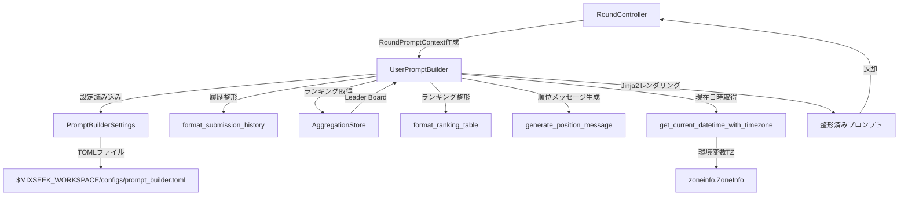
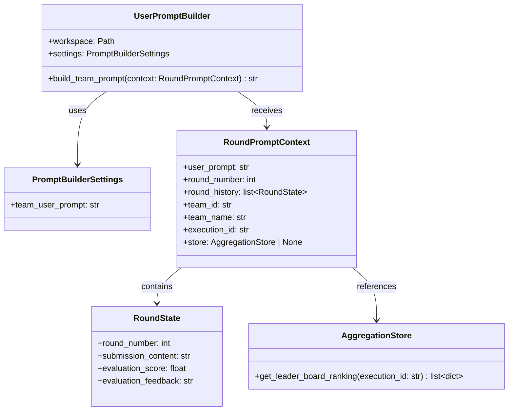
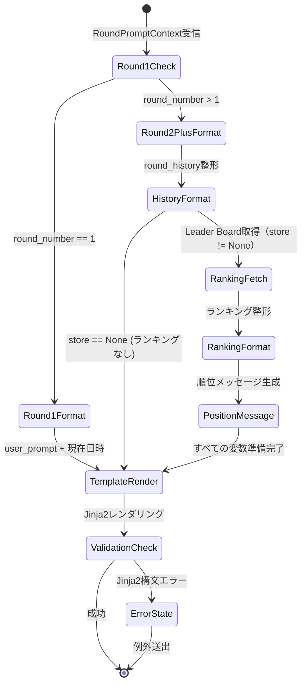

# Data Model: UserPromptBuilder

**Feature**: 092-user-prompt-builder-team
**Date**: 2025-11-19
**Status**: Phase 1 Design

このドキュメントは、UserPromptBuilder実装で使用するデータモデルを定義します。

---

## 1. Pydantic Models

### 1.1 PromptBuilderSettings

**目的**: UserPromptBuilderの設定を管理するPydantic Settings Model

**継承**: `pydantic_settings.BaseSettings`

**フィールド**:

| フィールド名 | 型 | デフォルト値 | 説明 |
|-------------|-----|-------------|------|
| `team_user_prompt` | `str` | `DEFAULT_TEAM_USER_PROMPT` | Teamに渡すユーザプロンプトのJinja2テンプレート文字列 |

**設定ソース優先順位**（高→低）:
1. 環境変数（`MIXSEEK_TEAM_USER_PROMPT`）
2. TOMLファイル（`$MIXSEEK_WORKSPACE/configs/prompt_builder.toml`）
3. デフォルト値

**バリデーション**:
- `team_user_prompt`: 空文字列不可（Jinja2構文エラーチェックは実行時）

**例**:

```python
from pydantic_settings import BaseSettings, SettingsConfigDict

class PromptBuilderSettings(BaseSettings):
    """UserPromptBuilder設定

    設定ソース優先順位（高→低）:
    1. 環境変数（MIXSEEK_プレフィックス）
    2. TOMLファイル（$MIXSEEK_WORKSPACE/configs/prompt_builder.toml）
    3. デフォルト値
    """

    team_user_prompt: str = DEFAULT_TEAM_USER_PROMPT

    model_config = SettingsConfigDict(
        env_prefix="MIXSEEK_",
        toml_file="configs/prompt_builder.toml",
        env_file_encoding="utf-8",
    )

    @field_validator("team_user_prompt")
    @classmethod
    def validate_team_user_prompt(cls, v: str) -> str:
        """team_user_promptが空でないことを確認"""
        if not v or v.strip() == "":
            raise ValueError("team_user_prompt cannot be empty")
        return v
```

---

### 1.2 RoundPromptContext

**目的**: プロンプト生成に必要なコンテキスト情報を保持するPydantic Model

**継承**: `pydantic.BaseModel`

**フィールド**:

| フィールド名 | 型 | 必須/任意 | 説明 |
|-------------|-----|----------|------|
| `user_prompt` | `str` | 必須 | 元のユーザプロンプト |
| `round_number` | `int` | 必須 | 現在のラウンド番号（1以上） |
| `round_history` | `list[RoundState]` | 必須 | 過去のラウンド履歴（すべてのラウンド） |
| `team_id` | `str` | 必須 | チームの一意識別子 |
| `team_name` | `str` | 必須 | チーム名 |
| `execution_id` | `str` | 必須 | 実行ID（Leader Board取得に使用） |
| `store` | `AggregationStore \| None` | 任意 | DuckDBストア（Leader Board取得用）。Noneの場合はランキング情報なし |

**バリデーション**:
- `round_number`: 1以上の整数
- `user_prompt`: 空文字列不可
- `team_id`, `team_name`, `execution_id`: 空文字列不可

**例**:

```python
from pydantic import BaseModel, field_validator
from mixseek.round_controller.models import RoundState
from mixseek.storage.aggregation_store import AggregationStore

class RoundPromptContext(BaseModel):
    """プロンプト生成コンテキスト"""

    user_prompt: str
    round_number: int
    round_history: list[RoundState]
    team_id: str
    team_name: str
    execution_id: str
    store: AggregationStore | None = None

    @field_validator("round_number")
    @classmethod
    def validate_round_number(cls, v: int) -> int:
        """ラウンド番号が1以上であることを確認"""
        if v < 1:
            raise ValueError("round_number must be >= 1")
        return v

    @field_validator("user_prompt", "team_id", "team_name", "execution_id")
    @classmethod
    def validate_not_empty(cls, v: str) -> str:
        """文字列フィールドが空でないことを確認"""
        if not v or v.strip() == "":
            raise ValueError(f"{cls.__name__} field cannot be empty")
        return v
```

---

### 1.3 RoundState（既存モデル、再利用）

**場所**: `mixseek.round_controller.models.RoundState`

**フィールド**:

| フィールド名 | 型 | 説明 |
|-------------|-----|------|
| `round_number` | `int` | ラウンド番号 |
| `submission_content` | `str` | Submissionの内容 |
| `evaluation_score` | `float` | 評価スコア（0-100） |
| `evaluation_feedback` | `str` | 評価フィードバック |

**用途**: 過去のラウンド履歴を保持し、プロンプトに履歴情報を統合する際に使用

---

## 2. データフロー

### 2.1 プロンプト生成フロー



### 2.2 プレースホルダー変数の整形

| 変数名 | 整形関数 | 入力 | 出力 |
|--------|---------|------|------|
| `submission_history` | `format_submission_history()` | `list[RoundState]` | 整形済み履歴文字列 |
| `ranking_table` | `format_ranking_table()` | `list[dict]` (Leader Board) | 整形済みランキング表 |
| `team_position_message` | `generate_position_message()` | `int` (順位), `int` (総チーム数) | 順位メッセージ |
| `current_datetime` | `get_current_datetime_with_timezone()` | なし | ISO 8601形式の現在日時 |

---

## 3. デフォルトテンプレート

### 3.1 DEFAULT_TEAM_USER_PROMPT

**場所**: `mixseek.prompt_builder.constants.DEFAULT_TEAM_USER_PROMPT`

**内容**:

```python
DEFAULT_TEAM_USER_PROMPT = """# ユーザから指定されたタスク
{{ user_prompt }}


# 過去の提出履歴
{{ submission_history }}


# 現在のチームランキング
現在のリーダーボードに基づく順位:

{{ ranking_table }}

{{ team_position_message }}


# 今回のラウンドの目標
上記のフィードバックを基に提出内容を改善してください。これまでのラウンドで指摘された弱点に焦点を当てましょう。

現在はラウンド1です。過去のSubmissionとランキング情報はまだありません。


---
現在日時: {{ current_datetime }}
"""
```

**特徴**:
- ラウンド1とラウンド2以降で出力が動的に変化
- 既存RoundController実装と完全に同じ出力を生成
- ranking_tableが空の場合はランキングセクション全体をスキップ

---

## 4. TOML設定ファイルテンプレート

### 4.1 prompt_builder.toml デフォルトテンプレート

**場所**: `$MIXSEEK_WORKSPACE/configs/prompt_builder.toml`

**生成方法**: `mixseek config init` コマンド

**内容**:

```toml
# UserPromptBuilder 設定ファイル
# 生成日時: 2025-11-19

[prompt_builder]
# Teamに渡すユーザプロンプトのJinja2テンプレート
# 利用可能なプレースホルダー変数:
#   - {{ user_prompt }}            : 元のユーザプロンプト
#   - {{ round_number }}            : 現在のラウンド番号（整数）
#   - {{ submission_history }}      : 過去のSubmission履歴（整形済み文字列）
#   - {{ ranking_table }}           : Leader Boardランキング情報（整形済み文字列）
#   - {{ team_position_message }}   : チーム順位メッセージ（整形済み文字列）
#   - {{ current_datetime }}        : 現在日時（ISO 8601形式、タイムゾーン付き）
#
# 注意:
#   - すべてのプレースホルダー変数は、UserPromptBuilder内で事前に整形されます
#   - テンプレート内でforループやフィルタを使用することは推奨されません
#   - 環境変数TZでタイムゾーンを設定できます（デフォルト: UTC）

team_user_prompt = """
# ユーザから指定されたタスク
{{ user_prompt }}


# 過去の提出履歴
{{ submission_history }}


# 現在のチームランキング
現在のリーダーボードに基づく順位:

{{ ranking_table }}

{{ team_position_message }}


# 今回のラウンドの目標
上記のフィードバックを基に提出内容を改善してください。これまでのラウンドで指摘された弱点に焦点を当てましょう。

現在はラウンド1です。過去のSubmissionとランキング情報はまだありません。


---
現在日時: {{ current_datetime }}
"""
```

---

## 5. エンティティ間の関係



---

## 6. バリデーションルール

### 6.1 設定ファイルバリデーション

| 項目 | ルール | エラーメッセージ |
|------|--------|----------------|
| `team_user_prompt` | 空文字列不可 | "team_user_prompt cannot be empty" |
| `team_user_prompt` | Jinja2構文チェック（実行時） | "Jinja2 template syntax error: ..." |

### 6.2 コンテキストバリデーション

| 項目 | ルール | エラーメッセージ |
|------|--------|----------------|
| `round_number` | >= 1 | "round_number must be >= 1" |
| `user_prompt` | 空文字列不可 | "user_prompt cannot be empty" |
| `team_id` | 空文字列不可 | "team_id cannot be empty" |
| `team_name` | 空文字列不可 | "team_name cannot be empty" |
| `execution_id` | 空文字列不可 | "execution_id cannot be empty" |

### 6.3 環境変数TZバリデーション

| 項目 | ルール | エラーメッセージ |
|------|--------|----------------|
| `TZ` | 有効なタイムゾーン名 | "Invalid timezone in TZ environment variable: {value}. Valid examples: 'UTC', 'Asia/Tokyo', 'America/New_York'" |
| `TZ` | 未設定時 | デフォルト値（UTC）を使用、エラーなし |

---

## 7. 状態遷移

### 7.1 プロンプト整形の状態遷移



---

## まとめ

本ドキュメントでは、以下のデータモデルを定義しました：

1. **PromptBuilderSettings**: 設定管理（Pydantic Settings）
2. **RoundPromptContext**: プロンプト生成コンテキスト
3. **RoundState**: 既存モデルの再利用（履歴管理）

これらのモデルは、Article 16（Python Type Safety Mandate）に準拠し、すべてのフィールドに型注釈とバリデーションを提供します。次のフェーズでは、これらのモデルを使用してAPI契約（contracts/）を定義します。
