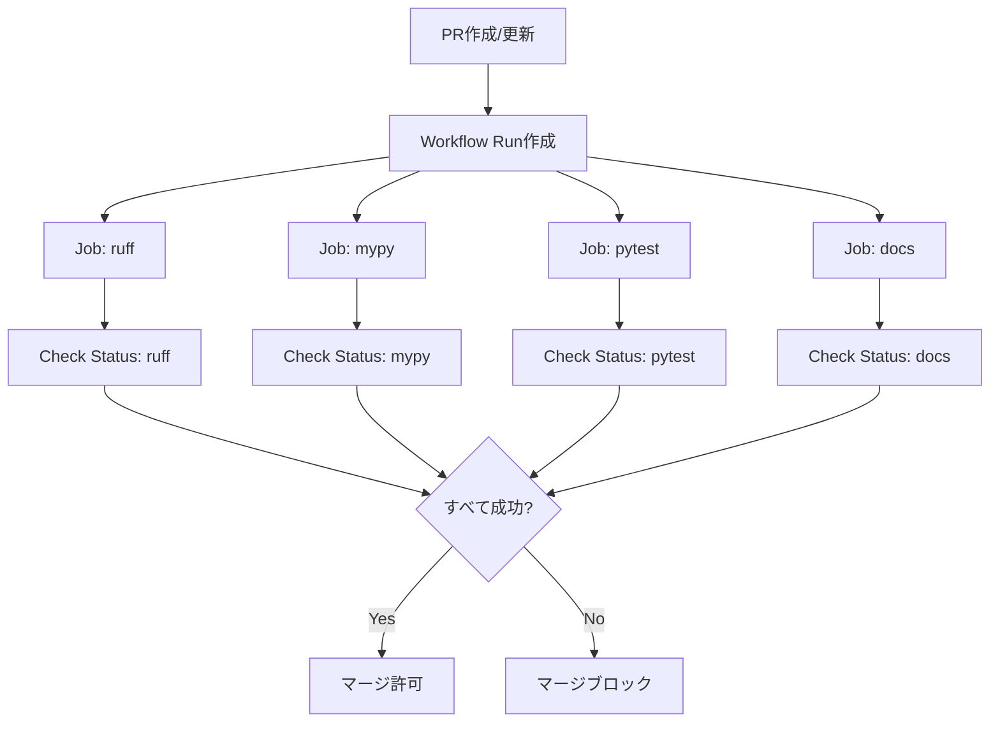

# Data Model: GitHub Actions CI Pipeline

**Feature**: 102-ci-github-actions
**Date**: 2025-11-19
**Status**: Draft

## Overview

GitHub Actions CIパイプラインはインフラストラクチャ機能であり、データベースやファイルに永続化されるエンティティは存在しません。このドキュメントでは、CIワークフロー内で扱われる概念的なデータ構造とGitHub Actions APIが提供する実行時情報を定義します。

## Conceptual Entities

### 1. Workflow Run

**Description**: 単一のCI実行インスタンス。PRが作成または更新された際にトリガーされる。

**Attributes**:
- `id` (string): GitHub Actionsが生成する一意のワークフロー実行ID
- `workflow_name` (string): ワークフロー名 "CI Pipeline"
- `triggered_by` (string): トリガー元(pull_request)
- `ref` (string): トリガーされたブランチ参照
- `sha` (string): トリガーされたコミットSHA
- `pull_request_number` (integer): 対象のPR番号
- `base_branch` (string): PRのターゲットブランチ(develop/main)
- `head_branch` (string): PRのソースブランチ
- `status` (enum): 実行ステータス(queued, in_progress, completed)
- `conclusion` (enum): 実行結果(success, failure, cancelled, skipped)
- `started_at` (datetime): 実行開始時刻
- `completed_at` (datetime): 実行完了時刻

**State Transitions**:
```
queued → in_progress → completed
```

**Validation Rules**:
- `base_branch` は "develop" または "main" でなければならない(ワークフローフィルタで保証)
- `completed_at` は `started_at` より後でなければならない

**Source**: GitHub Actions APIおよびワークフローコンテキスト(`${{ github }}`)

---

### 2. Job Execution

**Description**: 単一チェック(ruff, mypy, pytest, docs)の実行インスタンス。Workflow Run内で並列実行される。

**Attributes**:
- `id` (string): GitHub Actionsが生成する一意のジョブ実行ID
- `job_name` (enum): ジョブ名 ("ruff", "mypy", "pytest", "docs")
- `workflow_run_id` (string): 親のWorkflow Run ID
- `status` (enum): 実行ステータス(queued, in_progress, completed)
- `conclusion` (enum): 実行結果(success, failure, cancelled, skipped, timed_out)
- `runner_name` (string): 実行環境 "ubuntu-latest"
- `started_at` (datetime): ジョブ開始時刻
- `completed_at` (datetime): ジョブ完了時刻
- `timeout_minutes` (integer): タイムアウト設定(15分)

**Relationships**:
- 1 Workflow Run → N Job Executions (並列実行)

**State Transitions**:
```
queued → in_progress → completed (success/failure/timed_out)
                     → cancelled (concurrency制御による自動キャンセル)
```

**Validation Rules**:
- `job_name` は ["ruff", "mypy", "pytest", "docs"] のいずれかでなければならない
- 実行時間が `timeout_minutes` を超えた場合、`conclusion` は "timed_out" となる
- `completed_at` は `started_at` より後でなければならない

**Source**: GitHub Actions APIおよびジョブコンテキスト

---

### 3. Step Execution

**Description**: ジョブ内の個別ステップ(例: "Set up uv", "Run ruff")の実行インスタンス。

**Attributes**:
- `id` (string): GitHub Actionsが生成する一意のステップ実行ID
- `step_name` (string): ステップ名
- `job_id` (string): 親のJob Execution ID
- `status` (enum): 実行ステータス(queued, in_progress, completed)
- `conclusion` (enum): 実行結果(success, failure, skipped)
- `started_at` (datetime): ステップ開始時刻
- `completed_at` (datetime): ステップ完了時刻
- `outputs` (map<string, string>): ステップ出力変数(例: Python version)

**Relationships**:
- 1 Job Execution → N Step Executions (シーケンシャル実行)

**State Transitions**:
```
queued → in_progress → completed (success/failure)
                     → skipped (前のステップの失敗により)
```

**Validation Rules**:
- ステップは順番に実行され、前のステップが失敗した場合は後続ステップはスキップされる
- `completed_at` は `started_at` より後でなければならない

**Source**: GitHub Actions APIおよびステップコンテキスト

---

### 4. Check Status

**Description**: PRに表示されるステータスチェック結果。各ジョブ(ruff, mypy, pytest, docs)が独立したステータスチェックとして表示される。

**Attributes**:
- `check_name` (enum): チェック名 ("ruff", "mypy", "pytest", "docs")
- `pull_request_number` (integer): 対象のPR番号
- `commit_sha` (string): チェック対象のコミットSHA
- `status` (enum): チェックステータス(queued, in_progress, completed)
- `conclusion` (enum): チェック結果(success, failure, neutral, cancelled, skipped, timed_out)
- `output_title` (string): チェック結果のタイトル
- `output_summary` (string): チェック結果の要約
- `details_url` (string): GitHub ActionsのジョブログURL

**Relationships**:
- 1 PR → 4 Check Statuses (各ジョブに対応)
- 1 Check Status → 1 Job Execution

**Validation Rules**:
- `check_name` は ["ruff", "mypy", "pytest", "docs"] のいずれかでなければならない
- FR-013準拠: すべての4つのチェックが "success" でない限り、PRはマージできない(Branch Protection Rulesで強制)

**Source**: GitHub Checks API

---

### 5. Cache Entry

**Description**: uv依存関係のキャッシュエントリ。`uv.lock` ファイルのハッシュ値をキーとして管理される。

**Attributes**:
- `cache_key` (string): キャッシュキー(例: "Linux-uv-<hash-of-uv.lock>")
- `cache_paths` (list<string>): キャッシュ対象パス(uvの内部キャッシュディレクトリ)
- `restore_keys` (list<string>): フォールバックキャッシュキー
- `hit` (boolean): キャッシュヒットの有無
- `size_bytes` (integer): キャッシュサイズ(バイト)
- `created_at` (datetime): キャッシュ作成時刻
- `last_accessed_at` (datetime): 最終アクセス時刻

**State Transitions**:
```
not_exists → created (初回実行時)
created → hit (uv.lock未変更時)
created → expired → created (uv.lock変更時)
```

**Validation Rules**:
- `cache_key` は `uv.lock` ファイルの内容に基づいて生成される
- キャッシュは7日間アクセスがない場合、自動的に削除される(GitHub Actions仕様)

**Source**: `astral-sh/setup-uv` アクションの内部キャッシュメカニズム

---

### 6. Environment Variables

**Description**: CI実行時に使用される環境変数。GitHub Actionsコンテキストから取得される。

**Attributes**:
- `GITHUB_WORKFLOW` (string): ワークフロー名
- `GITHUB_RUN_ID` (string): ワークフロー実行ID
- `GITHUB_RUN_NUMBER` (integer): ワークフロー実行番号
- `GITHUB_SHA` (string): トリガーコミットSHA
- `GITHUB_REF` (string): トリガーブランチ参照
- `GITHUB_BASE_REF` (string): PRのベースブランチ
- `GITHUB_HEAD_REF` (string): PRのヘッドブランチ
- `GITHUB_EVENT_NAME` (string): トリガーイベント名(pull_request)
- `RUNNER_OS` (string): ランナーOS(Linux)
- `RUNNER_ARCH` (string): ランナーアーキテクチャ(X64)

**Validation Rules**:
- Article 9準拠: ハードコードされた値は使用せず、GitHub Actionsコンテキストから動的に取得

**Source**: GitHub Actionsランタイム環境

---

## Workflow Configuration Schema

以下はワークフローファイル(`.github/workflows/ci.yml`)の構造的スキーマ定義です。

```yaml
# ワークフロー定義
workflow:
  name: string                          # ワークフロー名
  on:                                   # トリガー設定
    pull_request:
      branches: [develop, main]         # ターゲットブランチフィルタ
  concurrency:                          # 同時実行制御
    group: string                       # 同時実行グループ
    cancel-in-progress: boolean         # 古いジョブの自動キャンセル

  jobs:                                 # ジョブ定義(並列実行)
    - job_id: ruff
      name: string
      runs-on: ubuntu-latest
      timeout-minutes: 15
      steps: [...]

    - job_id: mypy
      name: string
      runs-on: ubuntu-latest
      timeout-minutes: 15
      steps: [...]

    - job_id: pytest
      name: string
      runs-on: ubuntu-latest
      timeout-minutes: 15
      steps: [...]

    - job_id: docs
      name: string
      runs-on: ubuntu-latest
      timeout-minutes: 15
      steps: [...]
```

### Step Schema (各ジョブ共通)

```yaml
steps:
  - name: Checkout code
    uses: actions/checkout@v5

  - name: Set up uv
    uses: astral-sh/setup-uv@v6
    with:
      enable-cache: true
      # Automatically detects Python version from .python-version

  - name: Install dependencies
    # Each job installs only required dependencies:
    # - ruff, mypy, pytest: uv sync --locked --group dev
    # - docs: uv sync --locked --group docs
    run: uv sync --locked --group dev

  - name: Run check (job-specific)
    run: <job-specific-command>
```

---

## Data Flow



---

## Summary

CIパイプラインは以下の概念的エンティティで構成されます:

1. **Workflow Run**: CI実行インスタンス全体
2. **Job Execution**: 各チェック(ruff, mypy, pytest, docs)の実行単位
3. **Step Execution**: ジョブ内の個別ステップ
4. **Check Status**: PRに表示されるステータスチェック結果
5. **Cache Entry**: uv依存関係のキャッシュ
6. **Environment Variables**: 実行時環境変数

これらのエンティティはGitHub Actionsプラットフォームによって自動管理され、ワークフローファイル(`.github/workflows/ci.yml`)の定義に基づいて実行時に生成されます。
