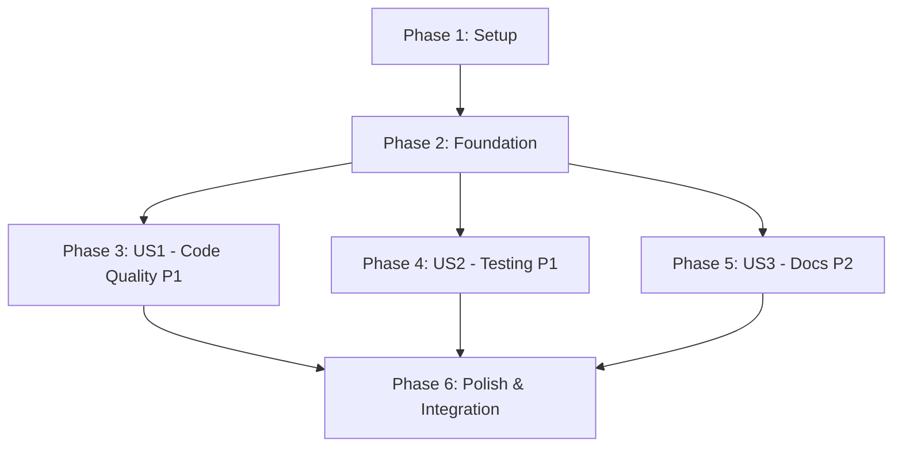

# Tasks: GitHub Actions CI Pipeline

**Input**: Design documents from `/specs/017-ci-github-actions/`
**Prerequisites**: plan.md (required), spec.md (required for user stories), research.md, data-model.md, contracts/

**Tests**: このCIパイプラインは実際のPR作成によるE2Eテストで検証されるため、ユニットテストは含まれません。

**Organization**: タスクはUser Story(優先度順)ごとにグループ化され、各ストーリーを独立して実装・テスト可能にしています。

## Format: `[ID] [P?] [Story] Description`
- **[P]**: 並列実行可能(異なるファイル、依存関係なし)
- **[Story]**: タスクが属するUser Story (例: US1, US2, US3)
- 説明には正確なファイルパスを含む

## Path Conventions
- Single project: `.github/workflows/` at repository root
- この機能はインフラストラクチャであり、`src/` や `tests/` には含まれない

---

## Phase 1: Setup (Shared Infrastructure)

**Purpose**: GitHub Actions CIパイプラインのディレクトリ構造作成

- [ ] T001 `.github/workflows/` ディレクトリを作成

**Checkpoint**: ワークフローディレクトリ準備完了

---

## Phase 2: Foundational (Blocking Prerequisites)

**Purpose**: すべてのUser Storyに共通する基本ワークフロー構造

**⚠️ CRITICAL**: このフェーズが完了するまで、User Story実装を開始できません

- [ ] T002 `.github/workflows/ci.yml` の基本構造を作成
  - ワークフロー名: "CI Pipeline"
  - トリガー設定: `pull_request` on `develop` and `main` branches
  - Concurrency設定: 同一PRの古いジョブを自動キャンセル(`cancel-in-progress: true`)
  - 参照: `contracts/workflow.yml` のトリガー契約とconcurrency契約

**Checkpoint**: 基本ワークフロー構造準備完了 - User Story実装を並列開始可能

---

## Phase 3: User Story 1 - Code Quality Verification (Priority: P1) 🎯 MVP

**Goal**: developまたはmainブランチへのPR作成時に、ruffとmypyによるコード品質チェックを自動実行し、結果をPRステータスとして表示する。

**Independent Test**:
1. テストブランチを作成し、意図的にruffエラー(余分なスペース等)を含むコードをコミット
2. developまたはmainへのPRを作成
3. `ruff` ジョブが失敗し、エラー箇所が明示されることを確認
4. エラーを修正し、`ruff` ジョブが成功することを確認
5. 同様に `mypy` ジョブで型エラーをテスト

### Implementation for User Story 1

- [ ] T003 [P] [US1] `.github/workflows/ci.yml` に `ruff` ジョブを追加
  - Runs-on: ubuntu-latest
  - Timeout: 15分
  - Steps:
    1. Checkout code (`actions/checkout@v5`)
    2. Set up uv (`astral-sh/setup-uv@v6` with `enable-cache: true`)
    3. Install dependencies (`uv sync --locked --group dev`)
    4. Run ruff check (`uv run ruff check .`)
    5. Run ruff format check (`uv run ruff format --check .`)
  - 参照: `research.md` セクション1(uv統合), `contracts/workflow.yml` Job 1

- [ ] T004 [P] [US1] `.github/workflows/ci.yml` に `mypy` ジョブを追加
  - Runs-on: ubuntu-latest
  - Timeout: 15分
  - Steps:
    1. Checkout code (`actions/checkout@v5`)
    2. Set up uv (`astral-sh/setup-uv@v6` with `enable-cache: true`)
    3. Install dependencies (`uv sync --locked --group dev`)
    4. Run mypy (`uv run mypy src tests`)
  - **Note**: チェック対象を`src`と`tests`に限定(プロジェクトルート全体は除外)
  - 参照: `research.md` セクション2(Pythonバージョン管理), `contracts/workflow.yml` Job 2

**Checkpoint**: User Story 1完了 - ruffとmypyによるコード品質チェックが機能し、独立してテスト可能

---

## Phase 4: User Story 2 - Automated Testing (Priority: P1)

**Goal**: developまたはmainブランチへのPR作成時に、pytestによる自動テスト(E2Eテスト除外)を実行し、結果をPRステータスとして表示する。

**Independent Test**:
1. テストブランチを作成し、既存のユニットテストが通ることを確認
2. developまたはmainへのPRを作成
3. `pytest` ジョブが実行され、E2Eテストが除外されることを確認(`pytest -m "not e2e"`)
4. 意図的にテストを失敗させ、`pytest` ジョブが失敗し詳細が表示されることを確認
5. テストを修正し、`pytest` ジョブが成功することを確認

### Implementation for User Story 2

- [ ] T005 [US2] `.github/workflows/ci.yml` に `pytest` ジョブを追加
  - Runs-on: ubuntu-latest
  - Timeout: 15分
  - Steps:
    1. Checkout code (`actions/checkout@v5`)
    2. Set up uv (`astral-sh/setup-uv@v6` with `enable-cache: true`)
    3. Install dependencies (`uv sync --locked --group dev`)
    4. Run tests excluding E2E (`uv run pytest -m "not e2e"`)
  - 参照: `research.md` セクション4(E2Eテスト除外), `contracts/workflow.yml` Job 3

**Checkpoint**: User Story 2完了 - pytestによる自動テストが機能し、E2Eテストが除外され、独立してテスト可能

---

## Phase 5: User Story 3 - Documentation Build Verification (Priority: P2)

**Goal**: developまたはmainブランチへのPR作成時に、Sphinxドキュメントが正しくビルドできることを検証し、結果をPRステータスとして表示する。

**Independent Test**:
1. テストブランチを作成し、ドキュメントが正しくビルドできることをローカルで確認(`uv run sphinx-build -W --keep-going -b html docs docs/_build/html`)
2. developまたはmainへのPRを作成
3. `docs` ジョブが実行され、ビルドが成功することを確認
4. 意図的にドキュメントに構文エラー(壊れたリンク等)を追加
5. `docs` ジョブが失敗し、エラー箇所が明示されることを確認
6. エラーを修正し、`docs` ジョブが成功することを確認

### Implementation for User Story 3

- [ ] T006 [US3] `.github/workflows/ci.yml` に `docs` ジョブを追加
  - Runs-on: ubuntu-latest
  - Timeout: 15分
  - Steps:
    1. Checkout code (`actions/checkout@v5`)
    2. Set up uv (`astral-sh/setup-uv@v6` with `enable-cache: true`)
    3. Install dependencies (`uv sync --locked --group docs`)
    4. Build documentation (`uv run sphinx-build -W --keep-going -b html docs docs/_build/html`)
  - `-W`: 警告をエラーとして扱う
  - `--keep-going`: エラー後も継続してすべてのエラーを表示
  - 参照: `research.md` セクション9(ドキュメントビルド検証), `contracts/workflow.yml` Job 4

**Checkpoint**: User Story 3完了 - Sphinxドキュメントビルド検証が機能し、独立してテスト可能

---

## Phase 6: Polish & Integration (Cross-Cutting Concerns)

**Purpose**: すべてのUser Storyを統合し、Branch Protection Rulesを設定

- [ ] T007 `.github/workflows/ci.yml` の最終レビューと最適化
  - 各ジョブが並列実行されることを確認
  - Timeout設定(15分)がすべてのジョブに適用されていることを確認
  - uvキャッシュが有効化されていることを確認
  - YAMLシンタックスが正しいことを検証

- [ ] T008 ワークフローファイルをコミットしてプッシュ
  - Branch: `102-ci-github-actions`
  - Commit message:
    ```
    feat(ci): Add GitHub Actions CI pipeline with ruff, mypy, pytest, and docs

    - Implement automated code quality checks (ruff, mypy)
    - Add automated testing with pytest (excluding E2E tests)
    - Add Sphinx documentation build verification
    - Configure uv caching for fast dependency installation
    - Set 15-minute timeout and parallel job execution
    - Support develop and main branch PRs

    🤖 Generated with [Claude Code](https://claude.com/claude-code)

    Co-Authored-By: Claude <noreply@anthropic.com>
    ```

- [ ] T009 GitHub リポジトリでBranch Protection Rulesを設定
  - Target branches: `develop` と `main`
  - Required status checks:
    - `ruff` (Code Formatting)
    - `mypy` (Static Type Checking)
    - `pytest` (Automated Testing)
    - `docs` (Documentation Build)
  - マージ前にすべてのチェックが成功する必要がある
  - 参照: `quickstart.md` の「Branch Protection Configuration」セクション
  - **Note**: この設定はCIが一度実行された後に実施可能

- [ ] T010 E2Eテストによる検証(quickstart.mdの検証手順に従う)
  - Test 1: PRトリガーテスト(developまたはmainへのPR作成)
  - Test 2: 並列実行検証(4ジョブが並列実行)
  - Test 3: キャッシュ有効性検証(2回目のCI実行時間が短縮)
  - Test 4: 失敗検出テスト(意図的なruffエラー)
  - Test 5: 同時実行制御テスト(PR更新時の古いジョブキャンセル)
  - Test 6: Branch Protectionテスト(チェック失敗時のマージブロック)
  - 参照: `quickstart.md` の「Verification」セクション

**Final Checkpoint**: CIパイプライン完全実装完了 - すべてのUser Storyが統合され、Branch Protection Rulesが有効

---

## Dependencies (User Story Completion Order)



**Critical Path**: Setup → Foundation → (US1 || US2 || US3) → Polish

**Notes**:
- Phase 1とPhase 2は順次実行が必須
- Phase 3, 4, 5(User Stories)は基盤完了後、並列実装可能
- Phase 6は全User Story完了後に実施

---

## Parallel Execution Examples

### Phase 3-5: User Stories (After Foundation Complete)

3名の開発者が並列作業可能:

```
Developer A: T003 (US1 ruff job)     → T007 (Review) → T010 (E2E Test)
Developer B: T004 (US1 mypy job)     → T008 (Commit)
Developer C: T005 (US2 pytest job) + T006 (US3 docs job) → T009 (Branch Protection)
```

**Rationale**:
- T003, T004, T005, T006は異なるジョブ定義のため、同一ファイル(`.github/workflows/ci.yml`)でもマージ容易
- T003とT004はUS1として同一フェーズだが、独立したYAMLジョブブロックのため並列作業可能

### Within Single User Story

T003とT004(US1)は並列実装可能:
- 両方とも `.github/workflows/ci.yml` に異なるジョブを追加
- YAMLのジョブブロックが独立しているため、競合リスク低い
- マージ時にYAMLインデントのみ調整

---

## Implementation Strategy

### MVP Scope (User Story 1のみ)

最小限の価値提供:
- T001-T004: ruffとmypyによるコード品質チェックのみ実装
- Branch Protection Rules: ruffとmypyのみ必須に設定
- **Delivery time**: 1-2時間(E2Eテスト含む)

### Full Implementation (All User Stories)

完全なCI/CDパイプライン:
- T001-T010: すべてのチェック(ruff, mypy, pytest, docs)を実装
- Branch Protection Rules: 4つすべてのチェックを必須に設定
- **Delivery time**: 3-4時間(E2Eテスト含む)

### Incremental Delivery Path

1. **Day 1**: MVP(US1) → ruffとmypyのみデプロイ
2. **Day 2**: US2追加 → pytestを統合
3. **Day 3**: US3追加 → docsビルドを統合
4. **Day 4**: Polish → 最終レビューとドキュメント更新

---

## Success Criteria Validation

各タスク完了後、以下のSuccess Criteriaを検証:

- **SC-001**: CI実行時間5分以内(キャッシュ有効時) → T010 Test 3で検証
- **SC-002**: 4つの独立したステータスチェック表示 → T010 Test 1で検証
- **SC-003**: 95%以上のケースでCI失敗検出 → T010 Test 4で検証
- **SC-004**: PR更新時の古いジョブ自動キャンセル → T010 Test 5で検証
- **SC-005**: チームメンバー80%以上が「品質問題早期発見」と回答 → 運用開始1週間後のアンケート
- **SC-006**: レビュワーの品質確認時間50%削減 → 運用開始2週間後の計測

---

## Task Summary

- **Total Tasks**: 10
- **Setup Tasks**: 1 (T001)
- **Foundation Tasks**: 1 (T002)
- **User Story 1 Tasks**: 2 (T003-T004)
- **User Story 2 Tasks**: 1 (T005)
- **User Story 3 Tasks**: 1 (T006)
- **Polish Tasks**: 4 (T007-T010)

### Task Count per User Story

- **US1 (Code Quality)**: 2 tasks (ruff, mypy)
- **US2 (Testing)**: 1 task (pytest)
- **US3 (Documentation)**: 1 task (docs)

### Parallel Opportunities

- **Phase 3-5**: 4 tasks can run in parallel (T003, T004, T005, T006)
- **Phase 6**: T007-T009 can overlap with T010 preparation

### Independent Test Criteria

各User Storyは独立してテスト可能:
- **US1**: ruffエラーとmypyエラーを意図的に発生させ、検出を確認
- **US2**: テスト失敗を意図的に発生させ、検出を確認
- **US3**: ドキュメント構文エラーを意図的に発生させ、検出を確認

### Suggested MVP Scope

**MVP = User Story 1のみ (T001-T004)**:
- 最も基本的なコード品質チェック(ruff, mypy)
- 他のUser Story実装前に価値提供開始
- チーム全体の品質文化形成に寄与

---

## References

- [Feature Specification](./spec.md) - User StoriesとRequirements
- [Implementation Plan](./plan.md) - 技術スタックと構成
- [Research Document](./research.md) - 技術決定と代替案
- [Data Model](./data-model.md) - CI概念的エンティティ
- [Contracts](./contracts/) - ワークフロー契約定義
- [Quickstart Guide](./quickstart.md) - 実装手順と検証方法
