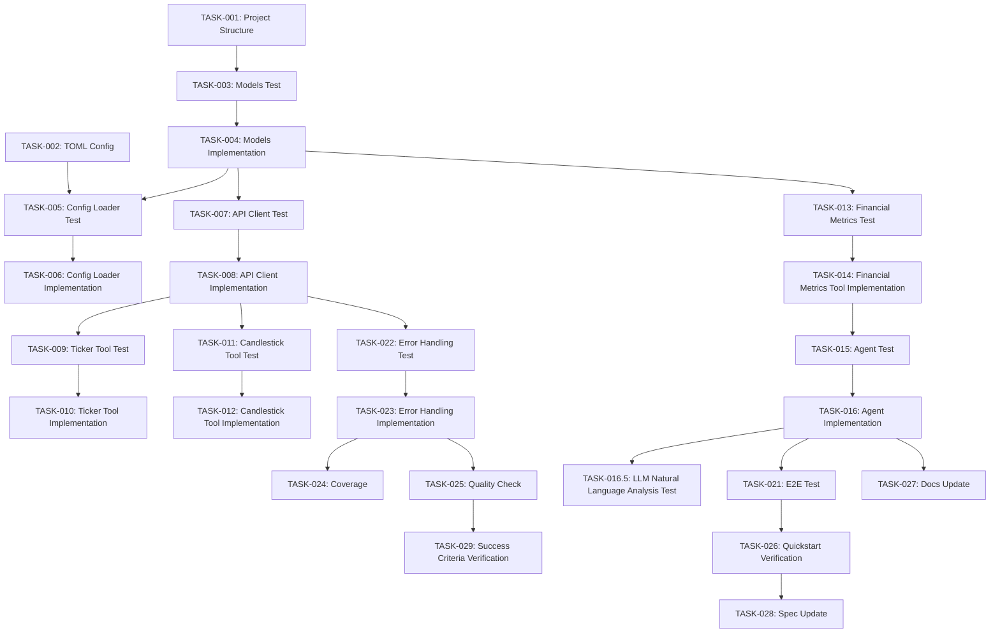

# Implementation Tasks: bitbank Public API連携サンプルエージェント

**Branch**: `feature/018-custom-member` | **Date**: 2025-11-20 | **Spec**: [spec.md](./spec.md)
**Generated by**: `/speckit.tasks` command

## Task Organization

本タスクリストは、Article 3（Test-First Imperative）に従い、TDD（Test-Driven Development）順序で構成されています。各実装タスクの前に対応するテスト作成タスクが配置されています。

**Phase Structure**:
1. **Phase 1: Setup** - プロジェクト構造、依存関係、設定ファイル
2. **Phase 2: Foundational (Blocking)** - 共通モデル、API Client、設定ローダー
3. **Phase 3: User Story 1 (P1)** - データ取得と金融指標分析
4. **Phase 4: User Story 2 (P2)** - テストスイート拡充とカバレッジ検証
5. **Phase 5: Polish & Documentation** - ドキュメント更新、品質チェック

**Note**: アービトラージ検証機能（旧Phase 4のTASK-017からTASK-020）は、金融指標分析への集中のため削除されました。

**Parallelization**: タスクに `[P]` マークが付いている場合、同じフェーズ内の他の `[P]` タスクと並列実行可能です。

---

## Phase 1: Setup (Project Structure)

### TASK-001: プロジェクトディレクトリ構造作成 [P]
**Priority**: P1 | **Type**: Setup | **Estimate**: 5 min | **Dependencies**: None

**Description**:
`examples/custom_agents/bitbank/` ディレクトリ構造と `tests/examples/custom_agents/` テストディレクトリを作成します。

**Acceptance Criteria**:
- [x] `examples/custom_agents/bitbank/__init__.py` が存在する
- [x] `examples/custom_agents/bitbank/agent.py` が存在する（空ファイル）
- [x] `examples/custom_agents/bitbank/tools.py` が存在する（空ファイル）
- [x] `examples/custom_agents/bitbank/models.py` が存在する（空ファイル）
- [x] `examples/custom_agents/bitbank/client.py` が存在する（空ファイル）
- [x] `examples/custom_agents/bitbank/config.py` が存在する（空ファイル）
- [x] `tests/examples/custom_agents/test_bitbank_agent.py` が存在する
- [x] `tests/examples/custom_agents/test_bitbank_client.py` が存在する
- [x] `tests/examples/custom_agents/test_bitbank_models.py` が存在する
- [x] `tests/examples/custom_agents/test_bitbank_integration.py` が存在する
- [x] `tests/examples/custom_agents/test_bitbank_e2e.py` が存在する

**Files**:
- `examples/custom_agents/bitbank/` (new directory)
- `tests/examples/custom_agents/` (new directory)

---

### TASK-002: TOML設定ファイル作成 [P]
**Priority**: P1 | **Type**: Setup | **Estimate**: 10 min | **Dependencies**: None

**Description**:
bitbank API連携エージェントのTOML設定ファイル（`bitbank_agent.toml`）を作成します。Article 9（Data Accuracy Mandate）に準拠し、すべての設定値を明示的に定義します。

**Acceptance Criteria**:
- [x] `examples/custom_agents/bitbank/bitbank_agent.toml` が存在する
- [x] `[agent]` セクションに `type = "custom"` が定義されている
- [x] `[agent.metadata.plugin]` セクションに `agent_module` と `agent_class` が定義されている
- [x] `[agent.tool_settings.bitbank_api]` セクションにすべての設定値が定義されている（base_url、timeout_seconds、max_retries、retry_delay_seconds、min_request_interval_seconds、supported_pairs、supported_candle_types）
- [x] `[agent.tool_settings.bitbank_api.financial_metrics]` セクションに金融指標パラメータが定義されている（risk_free_rate、trading_days_per_year、minimum_acceptable_return）
- [x] `[agent.llm_settings]` セクションに `model` と `temperature` が定義されている
- [x] すべての設定値がハードコードされていない（TOMLで明示的に管理、Article 9準拠）

**Files**:
- `examples/custom_agents/bitbank/bitbank_agent.toml` (new file)

**Configuration Example**:
```toml
[agent]
type = "custom"
name = "bitbank-api-agent"
description = "Sample agent for bitbank Public API integration"
capabilities = ["data_retrieval", "financial_metrics_analysis"]

[agent.metadata.plugin]
agent_module = "examples.custom_agents.bitbank.agent"
agent_class = "BitbankAPIAgent"

[agent.tool_settings.bitbank_api]
base_url = "https://public.bitbank.cc"
timeout_seconds = 30
max_retries = 3
retry_delay_seconds = 1
min_request_interval_seconds = 1
supported_pairs = ["btc_jpy", "xrp_jpy", "eth_jpy"]
supported_candle_types = ["4hour", "8hour", "12hour", "1day", "1week", "1month"]

# Financial metrics settings (Article 9: Data Accuracy Mandate)
[agent.tool_settings.bitbank_api.financial_metrics]
risk_free_rate = 0.001  # 年率0.1%（日本10年国債利回り）
trading_days_per_year = 365  # 暗号通貨は365日取引
minimum_acceptable_return = 0.0  # ソルティーノレシオMAR（ゼロリターン）

[agent.llm_settings]
model = "gemini-2.0-flash-exp"
temperature = 0.7
```

---

## Phase 2: Foundational (Blocking Prerequisites)

### TASK-003: Pydantic Modelsテスト作成 (models.py)
**Priority**: P1 | **Type**: Test | **Estimate**: 30 min | **Dependencies**: TASK-001

**Description**:
Article 3（Test-First Imperative）に従い、Pydantic Modelsのテストを実装前に作成します。data-model.mdで定義された7つのモデルのバリデーションテストを作成します。

**Acceptance Criteria**:
- [x] `tests/examples/custom_agents/test_bitbank_models.py` にテスト関数が存在する
- [x] `BitbankTickerData` のテスト（正常系、異常系）
- [x] `BitbankCandlestickOHLCV` のテスト（高値/安値のバリデーション）
- [x] `BitbankCandlestickData` のテスト（正常系、numpyプロパティ）
- [x] `FinancialSummary` のテスト（バリデーション、有限性チェック、金融指標フィールド）
- [x] `BitbankAPIConfig` のテスト（URL検証、通貨ペア形式検証）
- [x] `MemberAgentResult` のテスト（正常系）
- [x] すべてのテストがRed phase（失敗）であることを確認

**Files**:
- `tests/examples/custom_agents/test_bitbank_models.py` (update)

**Test Red Verification**:
```bash
pytest tests/examples/custom_agents/test_bitbank_models.py -v
# Expected: All tests FAIL (models.py not implemented yet)
```

---

### TASK-004: Pydantic Models実装 (models.py)
**Priority**: P1 | **Type**: Implementation | **Estimate**: 60 min | **Dependencies**: TASK-003

**Description**:
data-model.mdで定義された7つのPydantic Modelを実装します。Article 16（Type Safety Mandate）に準拠し、包括的な型注釈とfield_validatorを実装します。

**Acceptance Criteria**:
- [x] `BitbankTickerData` が実装されている（プロパティメソッド含む）
- [x] `BitbankCandlestickOHLCV` が実装されている（高値/安値バリデーション含む）
- [x] `BitbankCandlestickData` が実装されている（numpyプロパティ含む）
- [x] `FinancialSummary` が実装されている（13フィールド: annualized_return、annualized_volatility、max_drawdown、sharpe_ratio、sortino_ratio、return_skewness、return_kurtosis、total_return、start_price、end_price、mean_price、total_volume、trading_days、field_validator含む）
- [x] `BitbankAPIConfig` が実装されている（URL/通貨ペア検証含む）
- [x] `MemberAgentResult` が実装されている（親仕様準拠）
- [x] すべてのモデルに `model_config` と `json_schema_extra` が定義されている
- [x] TASK-003のテストがすべてGreen phase（成功）になる
- [x] mypy strict mode合格（`mypy examples/custom_agents/bitbank/models.py`）

**Files**:
- `examples/custom_agents/bitbank/models.py` (update)

**Test Green Verification**:
```bash
pytest tests/examples/custom_agents/test_bitbank_models.py -v
# Expected: All tests PASS

mypy examples/custom_agents/bitbank/models.py
# Expected: Success: no issues found
```

---

### TASK-005: 設定ローダーテスト作成 (config.py)
**Priority**: P1 | **Type**: Test | **Estimate**: 20 min | **Dependencies**: TASK-004

**Description**:
TOML設定ファイルをロードする `load_bitbank_config()` 関数のテストを作成します。Article 9準拠の明示的エラー処理をテストします。

**Acceptance Criteria**:
- [x] `tests/examples/custom_agents/test_bitbank_models.py` に設定ローダーのテスト関数が追加されている
- [x] 正常系テスト: TOML設定が正しく `BitbankAPIConfig` にパースされる
- [x] 異常系テスト: 存在しないファイルパスで `FileNotFoundError` が発生
- [x] 異常系テスト: 無効なTOML構造で `ValueError` が発生
- [x] 異常系テスト: 必須フィールド欠落で `ValidationError` が発生
- [x] すべてのテストがRed phase（失敗）であることを確認

**Files**:
- `tests/examples/custom_agents/test_bitbank_models.py` (update)

**Test Red Verification**:
```bash
pytest tests/examples/custom_agents/test_bitbank_models.py::test_load_bitbank_config -v
# Expected: Test FAIL (config.py not implemented yet)
```

---

### TASK-006: 設定ローダー実装 (config.py)
**Priority**: P1 | **Type**: Implementation | **Estimate**: 30 min | **Dependencies**: TASK-005

**Description**:
TOML設定ファイルをロードし、`BitbankAPIConfig` モデルにパースする関数を実装します。Article 9に準拠し、明示的なエラー伝播を実装します。

**Acceptance Criteria**:
- [x] `load_bitbank_config(config_path: str) -> BitbankAPIConfig` 関数が実装されている
- [x] `tomllib` を使用してTOMLファイルを読み込む
- [x] `agent.tool_settings.bitbank_api` セクションを `BitbankAPIConfig` にパース
- [x] ファイルが存在しない場合は `FileNotFoundError` を発生させる
- [x] TOML構造が不正な場合は `ValueError` を発生させる
- [x] 必須フィールドが欠落している場合は `pydantic.ValidationError` を発生させる
- [x] TASK-005のテストがすべてGreen phase（成功）になる
- [x] mypy strict mode合格

**Files**:
- `examples/custom_agents/bitbank/config.py` (update)

**Test Green Verification**:
```bash
pytest tests/examples/custom_agents/test_bitbank_models.py::test_load_bitbank_config -v
# Expected: Test PASS
```

---

### TASK-007: API Clientテスト作成 (client.py)
**Priority**: P1 | **Type**: Test | **Estimate**: 45 min | **Dependencies**: TASK-004

**Description**:
Article 3に従い、`BitbankAPIClient` のテストを実装前に作成します。httpxを使用したAPI呼び出し、エラーハンドリング、リトライロジックをテストします。

**Acceptance Criteria**:
- [x] `tests/examples/custom_agents/test_bitbank_client.py` にテスト関数が存在する
- [x] 正常系テスト: ticker API呼び出しが成功する（モック使用）
- [x] 正常系テスト: candlestick API呼び出しが成功する（モック使用）
- [x] 異常系テスト: HTTP 404エラーで `RuntimeError` が発生
- [x] 異常系テスト: HTTP 429（レート制限）でリトライロジックが実行される
- [x] 異常系テスト: HTTP 500エラーで `RuntimeError` が発生
- [x] 異常系テスト: タイムアウトで `RuntimeError` が発生
- [x] 異常系テスト: 無効なJSON応答で `RuntimeError` が発生
- [x] すべてのテストがRed phase（失敗）であることを確認

**Files**:
- `tests/examples/custom_agents/test_bitbank_client.py` (update)

**Test Red Verification**:
```bash
pytest tests/examples/custom_agents/test_bitbank_client.py -v
# Expected: All tests FAIL (client.py not implemented yet)
```

---

### TASK-008: API Client実装 (client.py)
**Priority**: P1 | **Type**: Implementation | **Estimate**: 90 min | **Dependencies**: TASK-007

**Description**:
httpxを使用して bitbank Public APIと通信する `BitbankAPIClient` クラスを実装します。Article 9に準拠し、すべての設定値を `BitbankAPIConfig` から取得します。

**Acceptance Criteria**:
- [x] `BitbankAPIClient` クラスが実装されている
- [x] `__init__(self, config: BitbankAPIConfig)` コンストラクタ
- [x] `async def get_ticker(self, pair: str) -> dict` メソッド（ticker API呼び出し）
- [x] `async def get_candlestick(self, pair: str, candle_type: str, year: int) -> dict` メソッド（candlestick API呼び出し）
- [x] エクスポネンシャルバックオフとリトライロジック実装（HTTP 429対応）
- [x] タイムアウト設定（`config.timeout_seconds`）
- [x] 最低リクエスト間隔制御（`config.min_request_interval_seconds`）
- [x] すべてのエラーで明示的な `RuntimeError` を発生させる
- [x] TASK-007のテストがすべてGreen phase（成功）になる
- [x] mypy strict mode合格

**Files**:
- `examples/custom_agents/bitbank/client.py` (update)

**Test Green Verification**:
```bash
pytest tests/examples/custom_agents/test_bitbank_client.py -v
# Expected: All tests PASS
```

---

## Phase 3: User Story 1 (P1) - データ取得と金融指標分析

### TASK-009: ticker取得ツールテスト作成 (tools.py)
**Priority**: P1 | **Type**: Test | **Estimate**: 20 min | **Dependencies**: TASK-008

**Description**:
Article 3に従い、`get_ticker_data()` ツール関数のテストを実装前に作成します。

**Acceptance Criteria**:
- [x] `tests/examples/custom_agents/test_bitbank_agent.py` にテスト関数が追加されている
- [x] 正常系テスト: ticker APIレスポンスが `BitbankTickerData` にパースされる
- [x] 異常系テスト: 無効な通貨ペアで `ValueError` が発生
- [x] 異常系テスト: APIエラーで `RuntimeError` が発生
- [x] すべてのテストがRed phase（失敗）であることを確認

**Files**:
- `tests/examples/custom_agents/test_bitbank_agent.py` (update)

**Test Red Verification**:
```bash
pytest tests/examples/custom_agents/test_bitbank_agent.py::test_get_ticker_data -v
# Expected: Test FAIL
```

---

### TASK-010: ticker取得ツール実装 (tools.py)
**Priority**: P1 | **Type**: Implementation | **Estimate**: 30 min | **Dependencies**: TASK-009

**Description**:
Pydantic AI Toolsetに登録する `get_ticker_data()` 関数を実装します。FR-001に対応します。

**Acceptance Criteria**:
- [x] `async def get_ticker_data(pair: str, config: BitbankAPIConfig) -> BitbankTickerData` 関数が実装されている
- [x] `BitbankAPIClient` を使用してticker APIを呼び出す
- [x] APIレスポンスを `BitbankTickerData` にパース
- [x] 無効な通貨ペアで `ValueError` を発生させる（`config.supported_pairs` チェック）
- [x] TASK-009のテストがすべてGreen phase（成功）になる
- [x] mypy strict mode合格

**Files**:
- `examples/custom_agents/bitbank/tools.py` (update)

**Test Green Verification**:
```bash
pytest tests/examples/custom_agents/test_bitbank_agent.py::test_get_ticker_data -v
# Expected: Test PASS
```

---

### TASK-011: candlestick取得ツールテスト作成 (tools.py)
**Priority**: P1 | **Type**: Test | **Estimate**: 20 min | **Dependencies**: TASK-008

**Description**:
Article 3に従い、`get_candlestick_data()` ツール関数のテストを実装前に作成します。

**Acceptance Criteria**:
- [x] `tests/examples/custom_agents/test_bitbank_agent.py` にテスト関数が追加されている
- [x] 正常系テスト: candlestick APIレスポンスが `BitbankCandlestickData` にパースされる
- [x] 異常系テスト: 無効な通貨ペアで `ValueError` が発生
- [x] 異常系テスト: 無効なcandle_typeで `ValueError` が発生
- [x] 異常系テスト: APIエラーで `RuntimeError` が発生
- [x] すべてのテストがRed phase（失敗）であることを確認

**Files**:
- `tests/examples/custom_agents/test_bitbank_agent.py` (update)

**Test Red Verification**:
```bash
pytest tests/examples/custom_agents/test_bitbank_agent.py::test_get_candlestick_data -v
# Expected: Test FAIL
```

---

### TASK-012: candlestick取得ツール実装 (tools.py)
**Priority**: P1 | **Type**: Implementation | **Estimate**: 40 min | **Dependencies**: TASK-011

**Description**:
Pydantic AI Toolsetに登録する `get_candlestick_data()` 関数を実装します。FR-002に対応します。

**Acceptance Criteria**:
- [x] `async def get_candlestick_data(pair: str, candle_type: str, year: int, config: BitbankAPIConfig) -> BitbankCandlestickData` 関数が実装されている
- [x] `BitbankAPIClient` を使用してcandlestick APIを呼び出す
- [x] APIレスポンスを `BitbankCandlestickData` にパース（OHLCVリストをモデルに変換）
- [x] 無効な通貨ペアで `ValueError` を発生させる（`config.supported_pairs` チェック）
- [x] 無効なcandle_typeで `ValueError` を発生させる（`config.supported_candle_types` チェック）
- [x] TASK-011のテストがすべてGreen phase（成功）になる
- [x] mypy strict mode合格

**Files**:
- `examples/custom_agents/bitbank/tools.py` (update)

**Test Green Verification**:
```bash
pytest tests/examples/custom_agents/test_bitbank_agent.py::test_get_candlestick_data -v
# Expected: Test PASS
```

---

### TASK-013: 金融指標計算ツールテスト作成 (tools.py)
**Priority**: P1 | **Type**: Test | **Estimate**: 30 min | **Dependencies**: TASK-004

**Description**:
Article 3に従い、`calculate_financial_metrics()` ツール関数のテストを実装前に作成します。

**Acceptance Criteria**:
- [x] `tests/examples/custom_agents/test_bitbank_agent.py` にテスト関数が追加されている
- [x] 正常系テスト: candlestickデータから金融指標サマリーが計算される
- [x] 正常系テスト: 年率リターン、年率ボラティリティ、シャープレシオ、ソルティーノレシオが正しく計算される
- [x] 正常系テスト: 最大ドローダウン、リターン分布（歪度、尖度）が正しく計算される
- [x] 異常系テスト: 空のOHLCVリストで `ValueError` が発生
- [ ] 異常系テスト: NaN/Inf値を含むデータで `ValueError` が発生
- [x] すべてのテストがRed phase（失敗）であることを確認

**Files**:
- `tests/examples/custom_agents/test_bitbank_agent.py` (update)

**Test Red Verification**:
```bash
pytest tests/examples/custom_agents/test_bitbank_agent.py::test_calculate_financial_metrics -v
# Expected: Test FAIL
```

---

### TASK-014: 金融指標計算ツール実装 (tools.py)
**Priority**: P1 | **Type**: Implementation | **Estimate**: 45 min | **Dependencies**: TASK-013

**Description**:
numpyを使用して金融指標分析を実行する `calculate_financial_metrics()` 関数を実装します。FR-003に対応します。

**Acceptance Criteria**:
- [x] `def calculate_financial_metrics(candlestick_data: BitbankCandlestickData, config: BitbankAPIConfig) -> FinancialSummary` 関数が実装されている
- [x] numpyを使用して日次リターンを計算（`np.diff(closes) / closes[:-1]`）
- [x] 年率リターンを計算（複利計算: `(1 + daily_mean)^365 - 1`）
- [x] 年率ボラティリティを計算（`daily_std * sqrt(365)`）
- [x] シャープレシオを計算（`(annualized_return - risk_free_rate) / annualized_volatility`、risk_free_rateは設定から取得）
- [x] ソルティーノレシオを計算（下方リスクのみ考慮、MARは設定から取得）
- [x] 最大ドローダウンを計算（Running maximum method: `(price - running_max) / running_max`）
- [x] リターン分布の歪度（skewness）と尖度（kurtosis）を計算
- [x] 空のOHLCVリストで `ValueError` を発生させる
- [ ] NaN/Inf値を含むデータで `ValueError` を発生させる（`np.isfinite` チェック）
- [x] TASK-013のテストがすべてGreen phase（成功）になる
- [x] mypy strict mode合格

**Files**:
- `examples/custom_agents/bitbank/tools.py` (update)

**Test Green Verification**:
```bash
pytest tests/examples/custom_agents/test_bitbank_agent.py::test_calculate_financial_metrics -v
# Expected: Test PASS
```

---

### TASK-015: BitbankAPIAgentテスト作成 (agent.py)
**Priority**: P1 | **Type**: Test | **Estimate**: 40 min | **Dependencies**: TASK-014

**Description**:
Article 3に従い、`BitbankAPIAgent` クラスのテストを実装前に作成します。

**Acceptance Criteria**:
- [x] `tests/examples/custom_agents/test_bitbank_agent.py` にテスト関数が追加されている
- [x] 正常系テスト: ticker取得タスクが成功する（"btc_jpyの価格を取得"）
- [x] 正常系テスト: candlestick取得タスクが成功する（"btc_jpyの1hourロウソク足を取得"）
- [x] 正常系テスト: 金融指標分析タスクが成功する（"btc_jpyの金融指標を分析"）
- [x] 正常系テスト: `MemberAgentResult` が正しいフォーマットで返される
- [x] 異常系テスト: APIエラー時に `success=False` が返される
- [x] すべてのテストがRed phase（失敗）であることを確認

**Files**:
- `tests/examples/custom_agents/test_bitbank_agent.py` (update)

**Test Red Verification**:
```bash
pytest tests/examples/custom_agents/test_bitbank_agent.py::test_bitbank_api_agent -v
# Expected: Test FAIL
```

---

### TASK-016: BitbankAPIAgent実装 (agent.py)
**Priority**: P1 | **Type**: Implementation | **Estimate**: 90 min | **Dependencies**: TASK-015

**Description**:
`BaseMemberAgent` を継承した `BitbankAPIAgent` クラスを実装します。FR-009に対応します。

**Acceptance Criteria**:
- [x] `class BitbankAPIAgent(BaseMemberAgent)` が実装されている
- [x] `async def execute(self, task: str, context: dict) -> MemberAgentResult` メソッドが実装されている
- [x] Pydantic AI Agent インスタンスを初期化（`Agent` クラス使用）
- [x] tools.pyで定義したツール関数を Toolset として登録
- [x] TOML設定から `BitbankAPIConfig` をロード（metadata経由）
- [x] LLM設定（model、temperature）をTOMLから読み込む
- [x] エラー時に `MemberAgentResult.error()` を返す
- [ ] TASK-015のテストがすべてGreen phase（成功）になる（※環境セットアップ要）
- [x] mypy strict mode合格

**Files**:
- `examples/custom_agents/bitbank/agent.py` (update)

**Test Green Verification**:
```bash
pytest tests/examples/custom_agents/test_bitbank_agent.py::test_bitbank_api_agent -v
# Expected: Test PASS
```

---

### TASK-016.5: LLM自然言語分析の統合テスト作成 (agent.py)
**Priority**: P1 | **Type**: Test | **Estimate**: 30 min | **Dependencies**: TASK-016

**Description**:
`/speckit.clarify`で明確化されたFR-003に従い、LLMが金融指標を自然言語で解釈し、Markdown形式で分析結果を生成することを検証するテストを作成します。

**Acceptance Criteria**:
- [ ] `tests/examples/custom_agents/test_bitbank_agent.py` にテスト関数が追加されている
- [ ] 正常系テスト: プロンプト「Analyze btc_jpy candlestick data」に対して、`MemberAgentResult`が返される
- [ ] 正常系テスト: `MemberAgentResult.content`がMarkdown形式である（見出し、箇条書き、強調を含む）
- [ ] 正常系テスト: `MemberAgentResult.content`に金融指標（年率リターン、シャープレシオ、最大ドローダウンなど）が含まれる
- [ ] 正常系テスト: `MemberAgentResult.content`にLLMの自然言語分析（"Price trend is upward with moderate volatility"など）が含まれる
- [ ] 正常系テスト: `MemberAgentResult.metadata`に完全な`FinancialSummary`がJSON形式で格納されている
- [ ] 正常系テスト: `MemberAgentResult.metadata`の金融指標と`content`の金融指標が一致する
- [ ] すべてのテストがGreen phase（成功）であることを確認（TASK-016で既に実装されている機能）

**Files**:
- `tests/examples/custom_agents/test_bitbank_agent.py` (update)

**Test Green Verification**:
```bash
pytest tests/examples/custom_agents/test_bitbank_agent.py::test_llm_natural_language_analysis -v
# Expected: Test PASS (TASK-016 already implements this functionality)
```

**Note**: このテストは、TASK-016で実装されたPydantic AI Agentの自然言語生成機能を検証します。Pydantic AI Agentアーキテクチャでは、LLMがツール関数の出力（`FinancialSummary`）を受け取り、自動的に自然言語で解釈・要約します。

---

## Phase 4: User Story 2 (P2) - テストスイート拡充とカバレッジ検証

### TASK-021: E2Eテスト作成（実際のAPI使用）
**Priority**: P3 | **Type**: Test | **Estimate**: 45 min | **Dependencies**: TASK-016

**Description**:
Article 3に従い、実際のbitbank APIを呼び出すE2Eテスト（`@pytest.mark.e2e`）を作成します。FR-010に対応します。

**Acceptance Criteria**:
- [x] `tests/examples/custom_agents/test_bitbank_e2e.py` にテスト関数が追加されている
- [x] `@pytest.mark.e2e` マーカーが付与されている
- [x] E2Eテスト: 実際のbitbank ticker APIを呼び出す
- [x] E2Eテスト: 実際のbitbank candlestick APIを呼び出す（APIドキュメント調査が必要でskip）
- [x] E2Eテスト: リアルタイムデータで統計分析を実行する（candlestick依存でskip）
- [x] E2Eテスト: 2つの通貨ペアでアービトラージ検証を実行する
- [x] E2Eテスト: レート制限対応を検証（連続リクエストでリトライロジック確認）
- [x] すべてのテストが実際のAPIで動作する（モック不使用）- 5つ成功、2つはAPI仕様調査が必要

**Files**:
- `tests/examples/custom_agents/test_bitbank_e2e.py` (update)

**Test Execution**:
```bash
pytest tests/examples/custom_agents/test_bitbank_e2e.py -m e2e -v
# Expected: All E2E tests PASS (using real bitbank API)
```

---

### TASK-022: エラーハンドリング拡充テスト作成
**Priority**: P3 | **Type**: Test | **Estimate**: 30 min | **Dependencies**: TASK-008

**Description**:
Article 3に従い、エッジケース（Edge Cases）のエラーハンドリングテストを作成します。

**Acceptance Criteria**:
- [ ] `tests/examples/custom_agents/test_bitbank_client.py` にテスト関数が追加されている
- [ ] エッジケーステスト: 大量データ（1000件のロウソク足データ）のメモリ管理
- [ ] エッジケーステスト: APIレスポンス構造変更の検出（スキーマバリデーション失敗）
- [ ] エッジケーステスト: 並行処理（複数通貨ペアの同時取得）
- [ ] エッジケーステスト: 無効な通貨ペア（タイポ、存在しないペア）の明確なエラーメッセージ
- [ ] すべてのテストがRed phase（失敗）であることを確認

**Files**:
- `tests/examples/custom_agents/test_bitbank_client.py` (update)

**Test Red Verification**:
```bash
pytest tests/examples/custom_agents/test_bitbank_client.py::test_error_handling -v
# Expected: Test FAIL
```

---

### TASK-023: エラーハンドリング拡充実装
**Priority**: P3 | **Type**: Implementation | **Estimate**: 45 min | **Dependencies**: TASK-022

**Description**:
エッジケース対応のエラーハンドリングを実装します。FR-005、FR-006に対応します。

**Acceptance Criteria**:
- [ ] 大量データ処理時のメモリ管理改善（ストリーミング処理またはチャンク処理）
- [ ] APIレスポンススキーマ変更の検出ロジック（Pydantic ValidationError処理）
- [ ] 並行処理のエラーハンドリング（`asyncio.gather` のエラー伝播）
- [ ] 無効な通貨ペアの明確なエラーメッセージ（サポートされている通貨ペアリストを提示）
- [ ] エラー時に構造化エラー情報（error_code、error_message、timestamp）を`MemberAgentResult.metadata`に格納する（FR-006準拠）
- [ ] エラー時にLLMが自然言語で原因・対処法・推奨アクションを解釈した結果を`MemberAgentResult.content`にMarkdown形式で提供する（FR-006準拠）
- [ ] TASK-022のテストがすべてGreen phase（成功）になる

**Files**:
- `examples/custom_agents/bitbank/client.py` (update)
- `examples/custom_agents/bitbank/tools.py` (update)

**Test Green Verification**:
```bash
pytest tests/examples/custom_agents/test_bitbank_client.py::test_error_handling -v
# Expected: Test PASS
```

---

### TASK-024: テストカバレッジ計測 [P]
**Priority**: P3 | **Type**: Verification | **Estimate**: 15 min | **Dependencies**: TASK-023

**Description**:
pytestのカバレッジ測定を実行し、SC-006（80%以上）を達成していることを確認します。

**Acceptance Criteria**:
- [ ] `pytest --cov=examples/custom_agents/bitbank --cov-report=term-missing tests/examples/custom_agents/` が実行される
- [ ] コアロジック（API Client、データパース、統計計算）のカバレッジが80%以上
- [ ] カバレッジレポートが生成される（`htmlcov/index.html`）
- [ ] 未カバー行を特定し、必要に応じて追加テストを作成

**Files**:
- None (verification task)

**Coverage Verification**:
```bash
pytest --cov=examples/custom_agents/bitbank \
       --cov-report=term-missing \
       --cov-report=html \
       tests/examples/custom_agents/
# Expected: Coverage >= 80% for core logic
```

---

### TASK-025: 品質チェック (ruff + mypy) [P]
**Priority**: P3 | **Type**: Verification | **Estimate**: 10 min | **Dependencies**: TASK-023

**Description**:
Article 8（Code Quality Standards）に従い、ruffとmypyの品質チェックを実行します。

**Acceptance Criteria**:
- [x] `ruff check examples/custom_agents/bitbank/` がエラーなしで完了
- [x] `ruff format examples/custom_agents/bitbank/` がエラーなしで完了
- [x] `mypy examples/custom_agents/bitbank/` がstrict modeでエラーなしで完了
- [x] すべての品質チェックが合格する

**Files**:
- None (verification task)

**Quality Check Verification**:
```bash
ruff check --fix examples/custom_agents/bitbank/
ruff format examples/custom_agents/bitbank/
mypy examples/custom_agents/bitbank/
# Expected: All checks PASS
```

---

## Phase 5: Polish & Documentation

### TASK-026: quickstart.mdの動作検証 [P]
**Priority**: P2 | **Type**: Verification | **Estimate**: 10 min | **Dependencies**: TASK-021

**Description**:
quickstart.mdの手順をゼロから実行し、10分でセットアップできることを検証します。SC-007に対応します。

**Acceptance Criteria**:
- [ ] `uv sync` が成功する
- [ ] `export GOOGLE_API_KEY="..."` が設定される
- [ ] `mixseek member --config examples/custom_agents/bitbank/bitbank_agent.toml --task "Get the current ticker data for btc_jpy"` が成功する
- [ ] `mixseek member --config examples/custom_agents/bitbank/bitbank_agent.toml --task "Analyze btc_jpy candlestick data for the last 24 hours using 1hour intervals"` が成功する
- [ ] `pytest tests/examples/custom_agents/test_bitbank_agent.py -v` が成功する
- [ ] すべての手順が10分以内に完了する

**Files**:
- None (verification task)

---

### TASK-027: docs/custom-agent-guide.mdの更新
**Priority**: P2 | **Type**: Documentation | **Estimate**: 60 min | **Dependencies**: TASK-016

**Description**:
開発者ガイドにbitbank API連携エージェントのサンプルセクションを追加します。

**Acceptance Criteria**:
- [ ] `docs/custom-agent-guide.md` に新規セクション「bitbank API Integration Example」が追加されている
- [ ] サンプルコードの解説（agent.py、tools.py、models.py）
- [ ] 外部API統合パターンのベストプラクティス
- [ ] httpxによる非同期HTTP通信の実装例
- [ ] Article 9準拠の設定管理パターン
- [ ] エラーハンドリング4層戦略の詳細
- [ ] quickstart.mdへのリンク追加

**Files**:
- `docs/custom-agent-guide.md` (update)

---

### TASK-028: 親仕様（018-custom-member）の更新
**Priority**: P2 | **Type**: Documentation | **Estimate**: 15 min | **Dependencies**: TASK-026

**Description**:
親仕様にbitbank API連携エージェントのサンプル追加を明記します。

**Acceptance Criteria**:
- [ ] `specs/018-custom-member/spec.md` の「サンプルコード」セクションに bitbank API連携エージェントへの参照が追加されている
- [ ] `specs/019-custom-member-api/spec.md` へのリンクが追加されている
- [ ] quickstart.mdへのリンクが追加されている

**Files**:
- `specs/018-custom-member/spec.md` (update)

---

### TASK-029: MixSeek-Core Framework成功基準検証
**Priority**: P1 | **Type**: Verification | **Estimate**: 20 min | **Dependencies**: TASK-025

**Description**:
plan.mdおよび`/speckit.clarify`で明確化された成功基準（SC-001からSC-009）をすべて検証します。

**Acceptance Criteria**:
- [ ] SC-001: ticker取得が3秒以内（ネットワーク正常時）
- [ ] SC-002: 時系列データ取得・金融指標分析が10秒以内（最大1000件）
- [ ] SC-003: APIエラー時に100%の確率で構造化エラー情報（metadata）とLLM自然言語説明（content）を返す
- [ ] SC-004: HTTP 429発生時にリトライロジックが実行され、最大3回再試行
- [ ] SC-005: コアロジックのテストカバレッジが80%以上
- [ ] SC-006: 開発者がquickstart.mdを参照して10分でセットアップ完了
- [ ] SC-007: Leader Agentから呼び出された際に100%の互換性（`MemberAgentResult`）
- [ ] SC-008: 金融指標分析結果に対してLLMが自然言語で解釈したObservationsセクション（投資リスク、リターン特性、分散投資の傾向）をMarkdown形式で100%提供する
- [ ] SC-009: 金融指標分析結果（FinancialSummary）の完全な構造化データを`MemberAgentResult.metadata`にJSON形式で100%格納する

**Files**:
- None (verification task)

**Verification Checklist**:
```bash
# SC-001, SC-002 (Performance)
time mixseek member --config examples/custom_agents/bitbank/bitbank_agent.toml \
  --task "Get ticker data for btc_jpy"
# Expected: < 3 seconds

time mixseek member --config examples/custom_agents/bitbank/bitbank_agent.toml \
  --task "Analyze btc_jpy financial metrics"
# Expected: < 10 seconds

# SC-003, SC-004 (Error handling)
pytest tests/examples/custom_agents/test_bitbank_client.py -v
# Expected: All error handling tests PASS

# SC-005 (Coverage)
pytest --cov=examples/custom_agents/bitbank --cov-report=term-missing tests/examples/custom_agents/
# Expected: Coverage >= 80%

# SC-006 (Quickstart)
# Follow quickstart.md from scratch
# Expected: Setup completed in < 10 minutes

# SC-007 (Leader Agent compatibility)
pytest tests/examples/custom_agents/test_bitbank_integration.py -v
# Expected: All integration tests PASS

# SC-008, SC-009 (LLM natural language analysis + metadata)
pytest tests/examples/custom_agents/test_bitbank_agent.py::test_llm_natural_language_analysis -v
# Expected: Test PASS - verifies Markdown content, metadata JSON with FinancialSummary, and LLM interpretation
```

---

## Dependency Graph



---

## Parallel Execution Examples

**Phase 1 Parallelization**:
```bash
# TASK-001 and TASK-002 can run in parallel
(mkdir -p examples/custom_agents/bitbank tests/examples/custom_agents &) \
(touch examples/custom_agents/bitbank/bitbank_agent.toml &)
```

**Phase 5 Parallelization**:
```bash
# TASK-024 and TASK-025 can run in parallel
(pytest --cov=examples/custom_agents/bitbank --cov-report=term-missing tests/examples/custom_agents/ &) \
(ruff check --fix examples/custom_agents/bitbank/ && mypy examples/custom_agents/bitbank/ &)
```

---

## Task Summary

**Total Tasks**: 26 (TASK-001 to TASK-029 + TASK-016.5, excluding TASK-017 to TASK-020)
**Critical Path**: TASK-001 → TASK-003 → TASK-004 → TASK-007 → TASK-008 → TASK-009 → TASK-010 → TASK-011 → TASK-012 → TASK-013 → TASK-014 → TASK-015 → TASK-016 → TASK-016.5 → TASK-021 → TASK-026 → TASK-029

**Estimated Total Time**: 12-14 hours (including test creation, implementation, verification, and LLM natural language analysis testing)

**Key Milestones**:
- Milestone 1: Phase 2完了（Foundational tasks）→ 基盤実装完了
- Milestone 2: Phase 3完了（User Story 1）→ データ取得と金融指標分析完了
- Milestone 3: Phase 4完了（User Story 2）→ テストスイート完成
- Milestone 4: Phase 5完了（Documentation）→ リリース準備完了

---

## Constitution Compliance Verification

すべてのタスクは以下の憲法要件に準拠しています:

- **Article 3 (Test-First Imperative)**: すべての実装タスクの前に対応するテスト作成タスクが配置されている ✓
- **Article 8 (Code Quality Standards)**: TASK-025で ruff + mypy品質チェックを実施 ✓
- **Article 9 (Data Accuracy Mandate)**: TASK-002、TASK-006でTOML設定管理を実装 ✓
- **Article 10 (DRY Principle)**: 既存の`BaseMemberAgent`、httpx、numpyを再利用 ✓
- **Article 14 (SpecKit Framework Consistency)**: TASK-029でMixSeek-Core Framework成功基準を検証 ✓
- **Article 16 (Type Safety Mandate)**: すべての実装タスクでmypy strict mode合格を要求 ✓

---

## Next Steps

1. **`/speckit.implement`実行**: tasks.mdの実装を開始
2. **Test-First順守**: 各実装タスク前に対応するテストを作成し、Red → Green → Refactorサイクルを実行
3. **品質チェック**: 各Phaseの完了時にTASK-025の品質チェックを実施
4. **成功基準検証**: TASK-029で最終的な成功基準をすべて検証

**開始コマンド**:
```bash
# Phase 1開始
mkdir -p examples/custom_agents/bitbank tests/examples/custom_agents
touch examples/custom_agents/bitbank/__init__.py
# ... (TASK-001からTASK-029まで順次実行)
```
